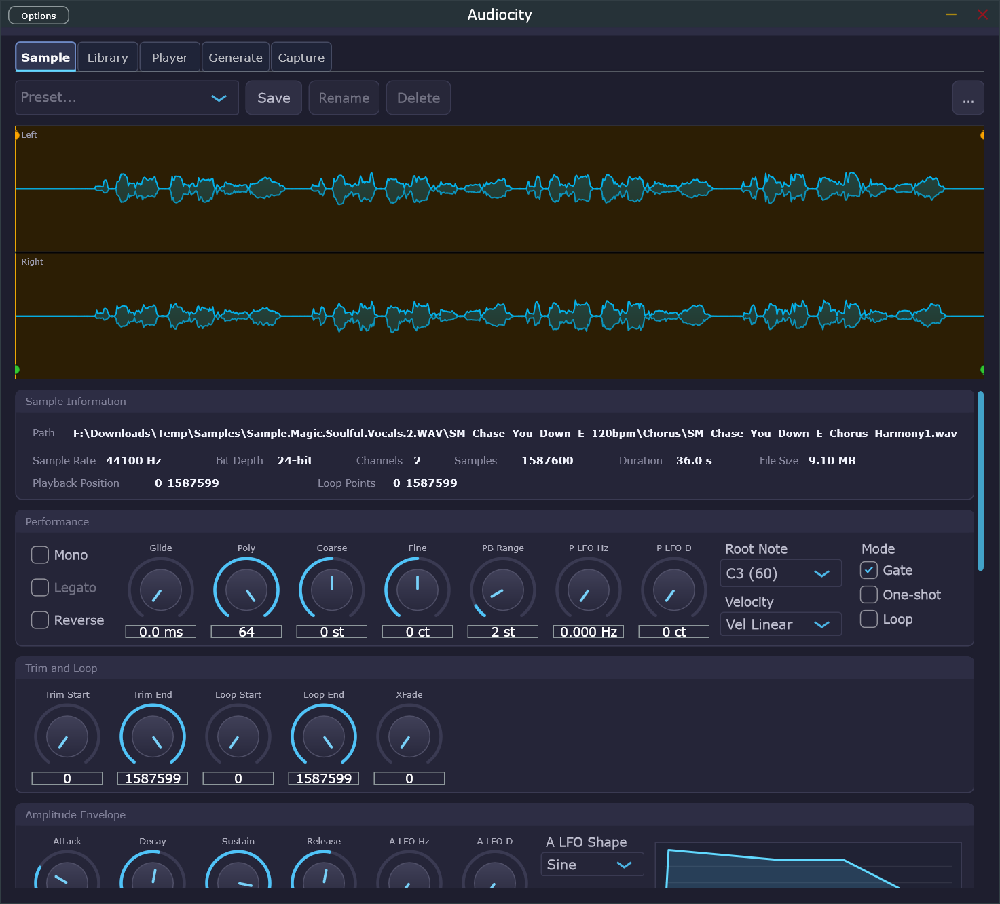
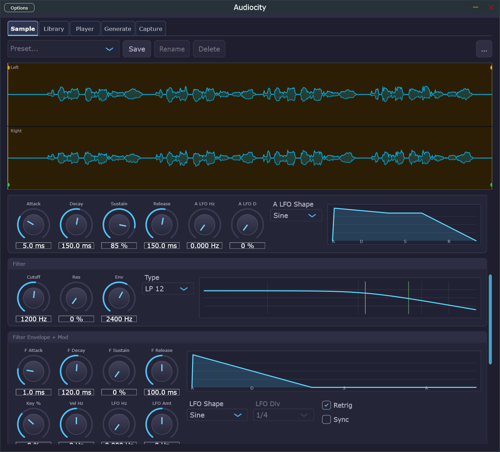
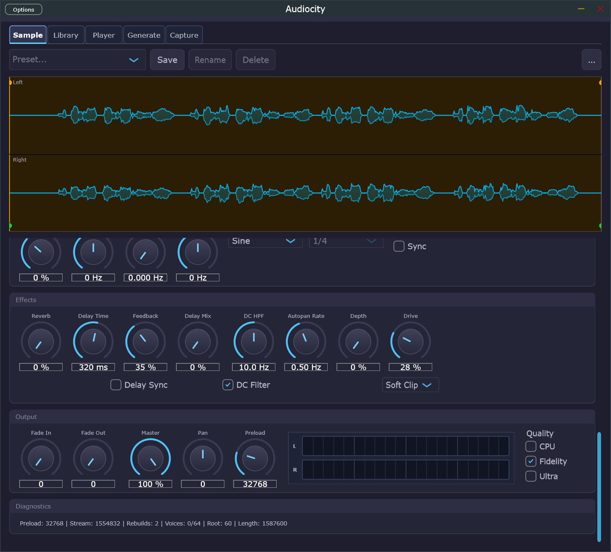
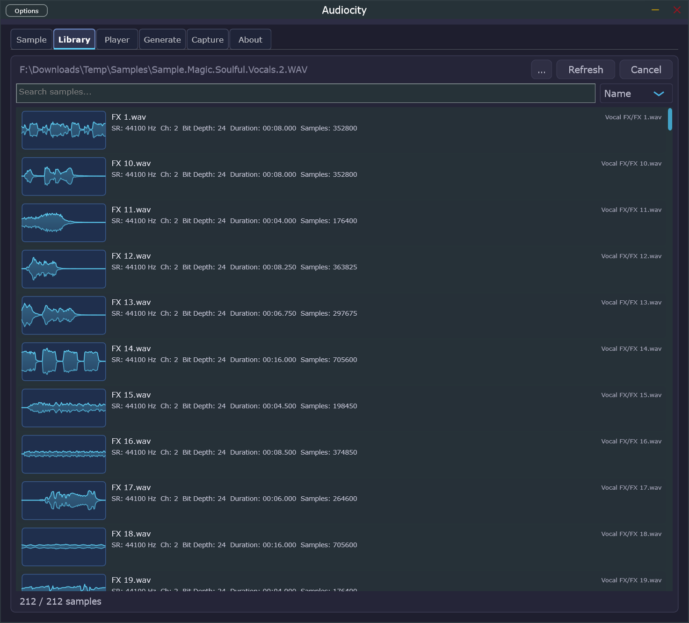
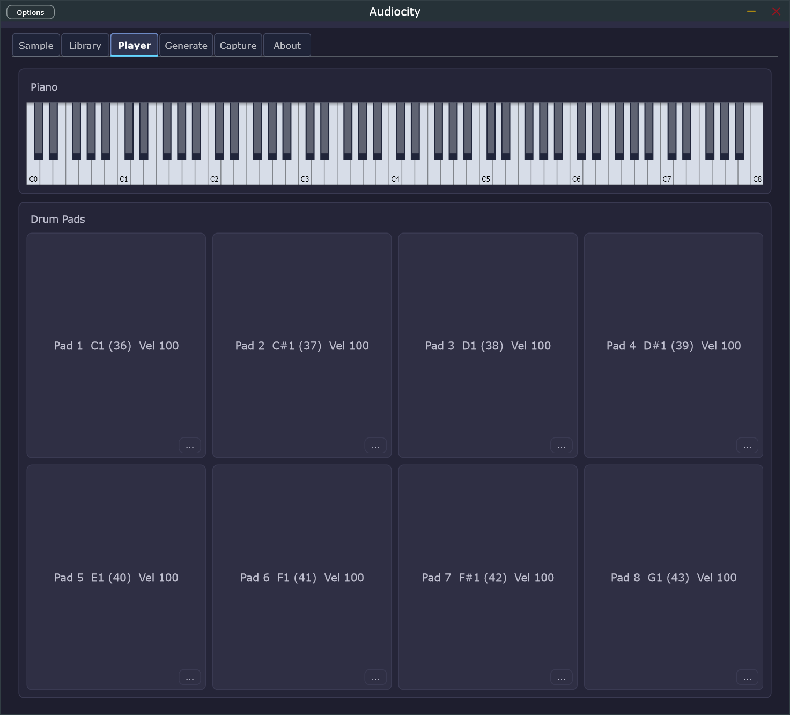
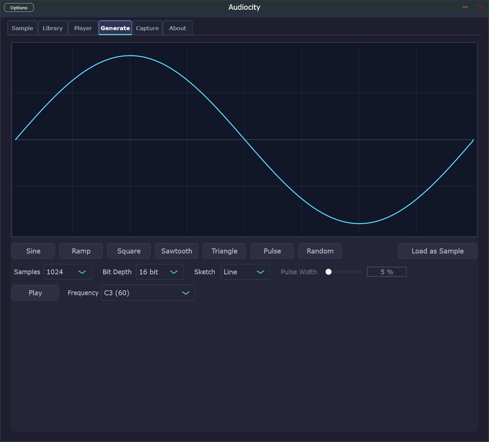
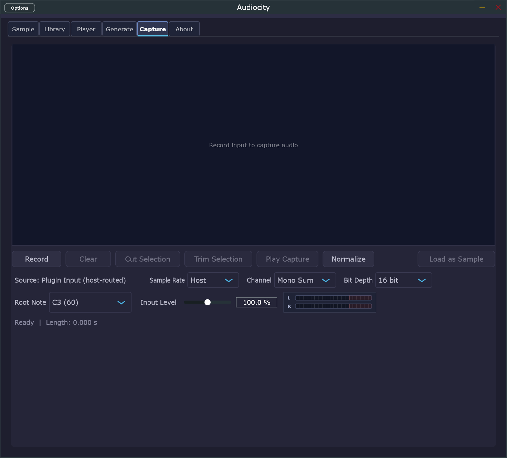

# Audiocity


A high-performance hybrid sampler built with JUCE and C++20, shipped as a Standalone Windows app and a VST3 instrument plugin.


## Overview

Audiocity is a Windows-focused sampler that runs from a single JUCE `AudioProcessor` implementation and is delivered in two forms:

- a standalone desktop application
- a VST3 instrument plugin

The engine and UI are developed against a spec-first architecture with explicit real-time safety rules, deterministic offline testing, and shared behavior across plugin and standalone targets.

## Screenshots

### Main Window

<p align="center">
	
	
	
</p>

- Screenshot 1: sample preset controls, waveform display, and sample information
- Screenshot 2: amp/filter envelopes, modulation controls, and filter response views
- Screenshot 3: effects, output metering, and diagnostics

### Tab Gallery

<table>
	<tr>
		<td valign="top" width="50%">
			<strong>Librarian</strong><br />
			<br />
			<ul>
				<li>Search and sort the sample library</li>
				<li>Preview files with metadata and waveform thumbnails</li>
			</ul>
		</td>
		<td valign="top" width="50%">
			<strong>Player</strong><br />
			<br />
			<ul>
				<li>Play samples from the piano keyboard</li>
				<li>Trigger and assign the drum pad bank</li>
			</ul>
		</td>
	</tr>
	<tr>
		<td valign="top" width="50%">
			<strong>Generate</strong><br />
			<br />
			<ul>
				<li>Create waveforms with sketching and one-click generators</li>
				<li>Choose sample count, bit depth, and playback preview settings</li>
			</ul>
		</td>
		<td valign="top" width="50%">
			<strong>Capture</strong><br />
			<br />
			<ul>
				<li>Record live input with gain and channel controls</li>
				<li>Trim, cut, normalize, and load the capture as a sample</li>
			</ul>
		</td>
	</tr>
</table>

## Current Feature Set

- Sample playback with pitch shifting by resampling
- Polyphony with explicit voice stealing
- Amp ADSR and filter ADSR with low-pass filtering
- Sampler-style UI with Browser, Mapping, Editor, Settings, and Diagnostics panels
- Preset save, rename, delete, and reload workflow using `.acp` XML payloads
- Library peak-preview caching with invalidation when the source library changes
- REX import support through the bundled REX SDK runtime
- Optional ASIO support when the Steinberg ASIO SDK is available at configure time
- Offline render test coverage for deterministic engine behavior

## Support

Support the project: &#9749; [Buy Me A Coffee](https://buymeacoffee.com/theosopher)

## Build Requirements

| Dependency | Version |
| --- | --- |
| CMake | 3.22 or newer |
| Visual Studio | 2022 |
| Compiler | MSVC with C++20 support |
| JUCE | 8.0.4 |
| Inno Setup | 6.x, for release installer builds |

Optional:

- Steinberg ASIO SDK for ASIO-enabled builds

## Quick Start

Bootstrap the development build and run tests:

```powershell
./scripts/bootstrap.ps1
```

Manual development build:

```bash
cmake --preset default
cmake --build --preset default --config Debug --target Audiocity_All
cmake --build --preset default --config Debug --target audiocity_offline_tests
ctest --test-dir build -C Debug --output-on-failure
```

## Release Builds

Release artifacts are built from a dedicated self-contained preset. The release executable is linked with the static MSVC runtime so it is as self-contained as practical on Windows.

Configure and build the self-contained release binaries only:

```bash
cmake --preset release-selfcontained
cmake --build --preset release-selfcontained
```

Build the complete release package set:

```powershell
./scripts/build_release.ps1
```

Optional ASIO-enabled release build:

```powershell
./scripts/build_release.ps1 -EnableAsio
```

The release script produces two artifacts in `output/`:

- `Audiocity-1.0.0-windows-x64-setup.exe`
- `Audiocity-1.0.0-windows-x64-portable.zip`

### Installer Behavior

The Inno Setup installer supports:

- per-user or per-machine installation
- Add/Remove Programs integration
- desktop shortcut creation
- Start Menu shortcuts for the standalone app
- automatic VST3 installation to the correct path for the selected install scope

VST3 install locations:

- per-user: `%LOCALAPPDATA%\Programs\Common\VST3`
- machine-wide: `%CommonProgramFiles%\VST3`

### Portable Package

The portable zip contains:

- the standalone application files ready to run after extraction
- a `VST3/` subfolder containing `Audiocity.vst3`
- `PortableInstall.txt` with manual plugin install instructions
- the MIT license

The plugin bundle is intentionally left in a separate subfolder so the end user can choose whether to copy it to the per-user or machine-wide VST3 location.

## VS Code Workflow

The workspace includes:

- Debug and Release launch configurations for the standalone app
- a debug launch configuration for the offline test runner
- build tasks for Debug and self-contained Release builds
- a `Release: Build Artifacts` task that runs the full release script

## Project Structure

```text
Audiocity/
├── assets/             # Icons and artwork
├── docs/               # Architecture, roadmap, RT rules, testing specs
├── installer/          # Inno Setup script and portable package docs
├── prompts/            # Milestone-oriented Copilot prompts
├── scripts/            # Bootstrap, cleanup, ASIO integration, release packaging
├── src/engine/         # EngineCore, VoicePool, RexLoader, engine-side utilities
├── src/plugin/         # PluginProcessor, PluginEditor, UI components, presets
├── tests/              # Offline render and packaging validation tests
├── third_party/        # JUCE, REX SDK, optional ASIO SDK
├── CMakeLists.txt
└── CMakePresets.json
```

## Architecture Notes

Audiocity is designed around a single processor shared by standalone and VST3 targets.

- Audio thread: rendering, mixing, DSP, and strict real-time-safe execution
- UI thread: parameter editing, browser actions, and diagnostic presentation
- Testing model: offline deterministic renders and regression-oriented packaging checks

Real-time rules are defined in `docs/02-real-time-rules.md`, and the higher-level architecture lives in `docs/01-architecture.md`.

## Cleanup

Remove rebuildable artifacts while preserving packaged release outputs:

```powershell
./scripts/cleanup_artifacts.ps1
./scripts/cleanup_artifacts.ps1 -IncludeOutput
```

With `-IncludeOutput`, packaged `.exe` and `.zip` artifacts at the output root are preserved.

## License

Copyright (c) 2026 Michael A. McCloskey. Audiocity is released under the MIT License. See `LICENSE`.
