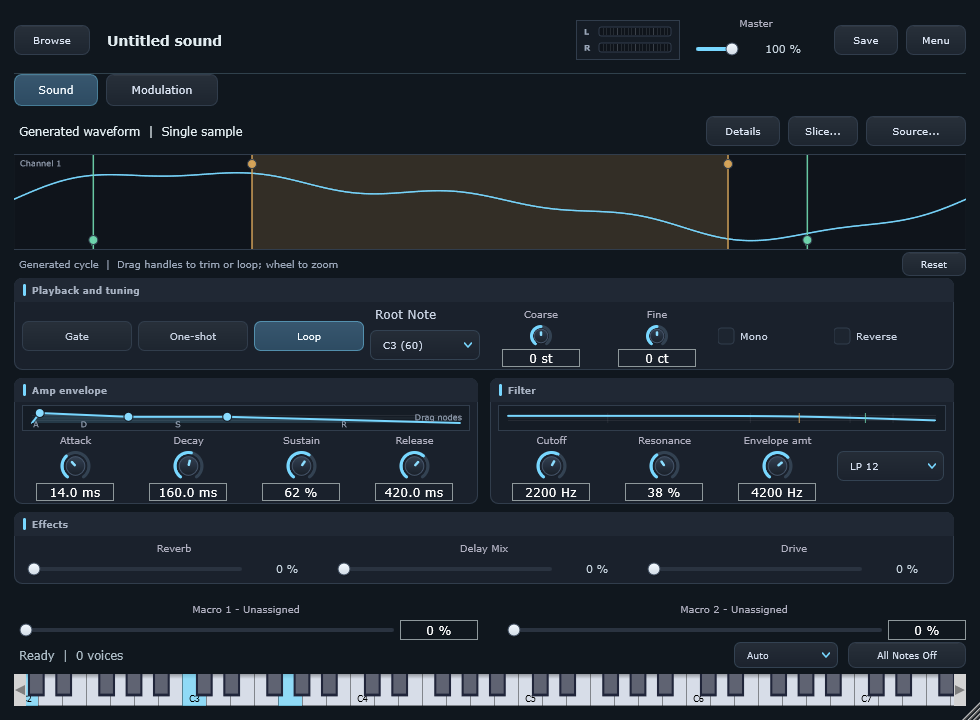
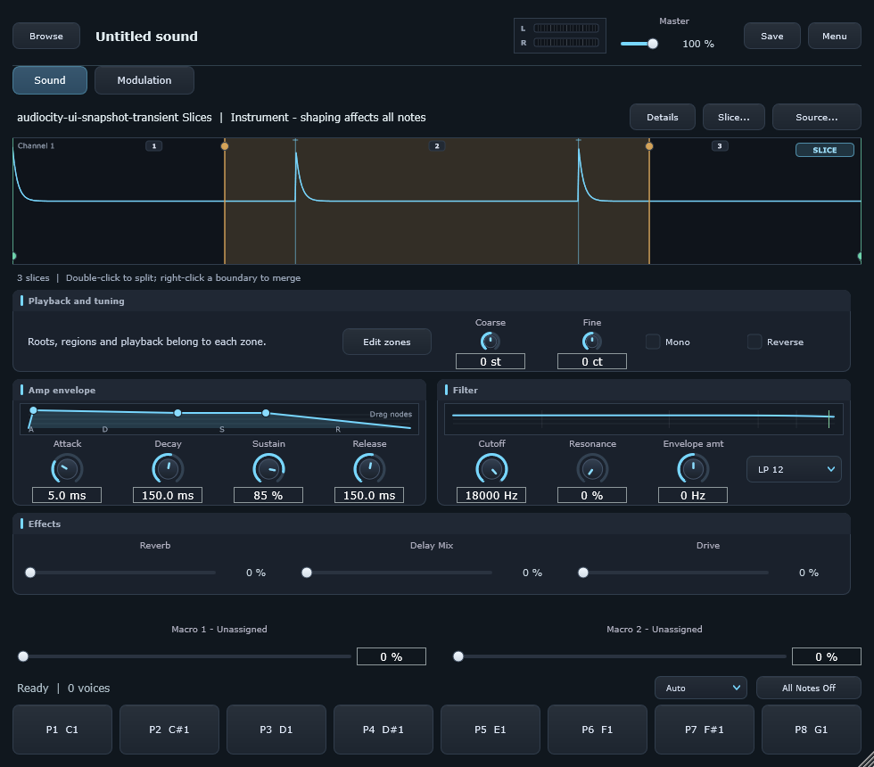

# Audiocity


**Turn any sound into an instrument.** A focused sampler for Windows, available as a standalone application and VST3 instrument.


## Overview

Audiocity brings sample and multisample import, slicing, recording, generated waveforms and expressive modulation into one instrument workflow. Start in Sound, shape and play, then save. The curated 64-preset factory bank is immediately available from Browse.

The standalone and plugin share the same JUCE/C++20 engine. Existing formats, presets, mappings, MIDI expression and host parameter IDs are preserved.

## Sampler simplification

- Sound and on-demand Modulation replace seven peer tabs.
- Amp, filter, tuning and essential effects fit at 980 × 720 without scrolling.
- One scoped browser supports search, favorites, recent items, sample preview and optional docking.
- One compact keyboard or pad surface replaces the permanent keyboard-plus-pads footer.
- Save As honors the selected path. Sound identity, edited state, Save and master output remain accessible.
- Record and Generate use preview, commit and cancel; replacement recovery and shaping Undo are covered by focused checks.
- Details and advanced single-zone repair/export retain depth while library authoring leaves the main experience.

Read the [user guide](docs/USER_GUIDE.md) and [implementation and validation notes](docs/SAMPLER_SIMPLIFICATION_2026-09-07.md).

## New in 1.3.2.0

- Imported-program loads now prepare on a background worker and publish on the message thread, so large sample/library imports no longer block the editor while stale jobs can be cancelled cleanly.
- Current libraries can now be saved as DecentSampler `.dspreset` files, with round-trip coverage for grouped gain/pan/release defaults, documented round robins, and choke-group semantics.
- The About, Generate, and Capture tabs have been split into standalone page components, reducing `PluginEditor` ownership while keeping the same UI behavior and snapshot coverage.
- Preset saves now embed the currently loaded single-sample source, so Wave- and AIFF-backed `.acp` presets round-trip without depending on an external sample path.
- Embedded preset restore now preserves multi-channel sample display data and restores the same loop, window, root-note, reverse, and playback-mode state on load.
- Library instrument rows now render explicit library placeholders instead of blank waveform panes, use accurate format badges, and show detailed import diagnostics when a double-click load fails.
- The persistent browser rail is hidden on the Generate and Capture tabs so those workflows stay focused on waveform creation and recording.

## New in 1.3

- A curated 64-preset bundled factory bank spanning bass, lead, pad, pluck, keys, bell, ensemble, and FX categories, with embedded audio so the presets travel cleanly between Standalone and VST3.
- Deterministic preset-authoring and auditioner tooling that regenerates the bank, renders it offline, and flags clipped output, weak levels, DC offset, or loop-seam regressions before release packaging.
- Sample-workspace polish with the responsive browser/workspace/inspector layout, searchable preset strip, persistent browser and performance rails, and clearer modulation or output feedback across the main editing pages.
- A dedicated engine profiling harness plus `scripts/profile_engine_harness.ps1`, which captures CPU samples, exports WPA data, and resolves hotspots through `llvm-symbolizer`.
- Filter and render-path follow-up optimizations backed by expanded offline regressions, so the higher-quality playback tiers keep their behavior while leaving more runtime headroom.

## Screenshots

Fresh offscreen renders from the same JUCE editor used by the standalone and VST3 builds:

<p align="center">
  
  
</p>
<p align="center">
  
  
</p>
<p align="center">
  
  
</p>

## Factory Presets and Auditioning

Audiocity now ships 64 bundled factory presets under `assets/factory_presets`, covering bass, lead, pad, pluck, keys, bell, ensemble, and FX categories. The presets embed their source audio so the same bank works in the standalone app, the VST3, the installer, and the portable package without any external sample dependency.

The content workflow is deterministic and test-backed:

- `tools/PresetAuthor.cpp` regenerates the factory bank.
- `tools/PresetAuditioner.cpp` renders the presets offline and writes reports under `artifacts/preset_audition/`.
- `tests/OfflineRenderTests.cpp` enforces loop-mode, modulation/filter coverage, and other factory-bank quality gates before release packaging.

## Supported Formats

- Direct sample load: WAV, AIFF, FLAC, OGG, and NCW through an external converter command.
- Imported instruments and loops: SFZ, REX/RX2, SF2, DecentSampler `.dspreset`, Bitwig `.multisample`, MPC `.xpm`, 1010music Bento `preset.xml`, TAL Sampler `.talsmpl`, TX16Wx `.txprog`, Korg `.korgmultisample` and `.kmp`, Ableton `.adv` and `.adg`, disting EX `.dexpreset`, EXS24 `.exs`, and a validated legacy NKI subset.
- Exported instruments: SFZ and DecentSampler `.dspreset`.
- Detection-only diagnostics: Reason NN-XT `.sxt` and protected/encrypted Kontakt content are identified and reported, but not imported.

## Support

Support the project: &#9749; [Buy Me A Coffee](https://buymeacoffee.com/theosopher)

## Build Requirements

| Dependency | Version |
| --- | --- |
| CMake | 3.22 or newer |
| Visual Studio | 2022 |
| Compiler | MSVC with C++20 support |
| JUCE | 8.0.4 |
| Inno Setup | 6.x, for release installer builds |

Optional:

- Steinberg ASIO SDK for ASIO-enabled builds
- An NCW conversion tool exposed through `AUDIOCITY_NCW_CONVERTER_COMMAND` if you want to load NCW-backed content

## Quick Start

Bootstrap the development build and run tests:

```powershell
./scripts/bootstrap.ps1
```

The bootstrap and CI use the ASIO-disabled `ci-windows` preset, which targets the documented Visual Studio 2022 toolchain. The existing `default` preset remains available for VS2026 development with the ASIO SDK.

Manual Debug test build and complete nine-test matrix:

```powershell
cmake --preset ci-windows
cmake --build --preset ci-windows --target audiocity_offline_tests audiocity_ui_snapshot_harness audiocity_preset_runtime_smoke audiocity_ui_snapshot_header_smoke audiocity_ui_snapshot_core_smoke
ctest --preset ci-windows
```

Build and verify the products users receive in a separate Release configuration:

```powershell
cmake --build --preset ci-windows-release
./scripts/verify_release_artifacts.ps1 -BuildDir build/ci-windows -Configuration Release
```

The offline executable supports `--suite engine|import|state|preset`, `--filter <text>`, and `--list`. See [docs/05-testing.md](docs/05-testing.md) for sanitizer/fuzz, coverage, render-deadline, VST3 host-validation, and UI-snapshot commands.

## Engine Profiling

Capture a symbolized CPU sample run of the dedicated engine harness and write the raw trace, WPA CSV exports, and summarized hotspots under `build/tests/profile-runs/`:

```powershell
./scripts/profile_engine_harness.ps1
./scripts/profile_engine_harness.ps1 -Seconds 6 -Quality ultra -Voices 32 -BlockSize 64
```

The profiling script builds `audiocity_engine_profile` in `RelWithDebInfo` by default, captures CPU samples with the Visual Studio diagnostics collector, exports WPA tables, and resolves the harness module's hot addresses through `llvm-symbolizer`.

## Release Builds

Release artifacts are built from a dedicated self-contained preset. The release executable is linked with the static MSVC runtime so it is as self-contained as practical on Windows.

Configure and build the self-contained release binaries only:

```bash
cmake --preset release-selfcontained-asio
cmake --build --preset release-selfcontained-asio
```

Build the complete release package set:

```powershell
./scripts/build_release.ps1
```

Build the release package set without ASIO:

```powershell
./scripts/build_release.ps1 -DisableAsio
```

The release script derives the version from `CMakeLists.txt` and produces two artifacts in `output/`:

- `Audiocity-1.3.2.0-windows-x64-setup.exe`
- `Audiocity-1.3.2.0-windows-x64-portable.zip`

### Installer Behavior

The Inno Setup installer supports:

- per-user or per-machine installation
- Add/Remove Programs integration
- desktop shortcut creation
- Start Menu shortcuts for the standalone app
- automatic VST3 installation to the correct path for the selected install scope
- bundled factory presets for both the standalone app and the VST3 package

VST3 install locations:

- per-user: `%LOCALAPPDATA%\Programs\Common\VST3`
- machine-wide: `%CommonProgramFiles%\VST3`

### Portable Package

The portable zip contains:

- the standalone application files ready to run after extraction
- a `VST3/` subfolder containing `Audiocity.vst3`
- `PortableInstall.txt` with manual plugin install instructions
- bundled factory presets
- the MIT license

The plugin bundle is intentionally left in a separate subfolder so the end user can choose whether to copy it to the per-user or machine-wide VST3 location.

## VS Code Workflow

The workspace includes:

- Debug and Release launch configurations for the standalone app
- a debug launch configuration for the offline test runner
- build tasks for Debug and self-contained Release builds
- a `Release: Build Artifacts` task that runs the full release script

## Project Structure

```text
Audiocity/
├── artifacts/          # Generated preset audition and validation reports
├── assets/             # Icons, artwork, and factory presets
├── docs/               # Architecture, roadmap, RT rules, testing specs
├── installer/          # Inno Setup script and portable package docs
├── prompts/            # Milestone-oriented Copilot prompts
├── scripts/            # Bootstrap, cleanup, ASIO integration, release packaging
├── src/engine/         # EngineCore, streaming, importers, and engine-side utilities
├── src/plugin/         # PluginProcessor, PluginEditor, UI components, presets
├── tests/              # Offline render, packaging, and UI snapshot validation
├── third_party/        # JUCE, REX SDK, optional ASIO SDK
├── tools/              # Preset authoring, auditioning, and support utilities
├── CMakeLists.txt
└── CMakePresets.json
```

## Architecture Notes

Audiocity is designed around a single processor shared by standalone and VST3 targets.

- Audio thread: rendering, mixing, streaming requests, and strict real-time-safe execution
- UI thread: parameter editing, browser actions, import workflows, and diagnostic presentation
- Testing model: offline deterministic renders plus snapshot and packaging regression checks

Real-time rules are defined in `docs/02-real-time-rules.md`, and the higher-level architecture lives in `docs/01-architecture.md`.

## Cleanup

Remove rebuildable artifacts while preserving packaged release outputs:

```powershell
./scripts/cleanup_artifacts.ps1
./scripts/cleanup_artifacts.ps1 -IncludeOutput
```

With `-IncludeOutput`, packaged `.exe` and `.zip` artifacts at the output root are preserved.

## License

Copyright (c) 2026 Michael A. McCloskey. Audiocity is released under the MIT License. See `LICENSE`.
