# Audiocity


A Windows-focused hybrid sampler built with JUCE and C++20, delivered as a standalone application and a VST3 instrument plugin.


## Overview

Audiocity 1.3.1.0 combines broad multisample import coverage, transient slicing, expressive modulation, and a modernized sampler workspace with a curated 64-preset factory bank, auditioner-backed preset QA, and a dedicated profiling workflow for engine tuning.

The engine and UI are still driven by one JUCE `AudioProcessor`, with deterministic offline tests, snapshot-based UI validation, and shared behavior across the plugin and standalone targets.

## New in 1.3.1.0

- Preset saves now embed the currently loaded single-sample source, so Wave- and AIFF-backed `.acp` presets round-trip without depending on an external sample path.
- Embedded preset restore now preserves multi-channel sample display data and restores the same loop, window, root-note, reverse, and playback-mode state on load.
- Library instrument rows now render explicit library placeholders instead of blank waveform panes, use accurate format badges, and show detailed import diagnostics when a double-click load fails.
- The persistent browser rail is hidden on the Generate and Capture tabs so those workflows stay focused on waveform creation and recording.

## New in 1.3

- A curated 64-preset bundled factory bank spanning bass, lead, pad, pluck, keys, bell, ensemble, and FX categories, with embedded audio so the presets travel cleanly between Standalone and VST3.
- Deterministic preset-authoring and auditioner tooling that regenerates the bank, renders it offline, and flags clipped output, weak levels, DC offset, or loop-seam regressions before release packaging.
- Sample-workspace polish with the responsive browser/workspace/inspector layout, searchable preset strip, persistent browser and performance rails, and clearer modulation or output feedback across the main editing pages.
- A dedicated engine profiling harness plus `scripts/profile_engine_harness.ps1`, which captures CPU samples, exports WPA data, and resolves hotspots through `llvm-symbolizer`.
- Filter and render-path follow-up optimizations backed by expanded offline regressions, so the higher-quality playback tiers keep their behavior while leaving more runtime headroom.

## Screenshots

The screenshots below come from the deterministic UI snapshot harness used in the test suite, so they match the current application state.

### Sample Workspace

<p align="center">
	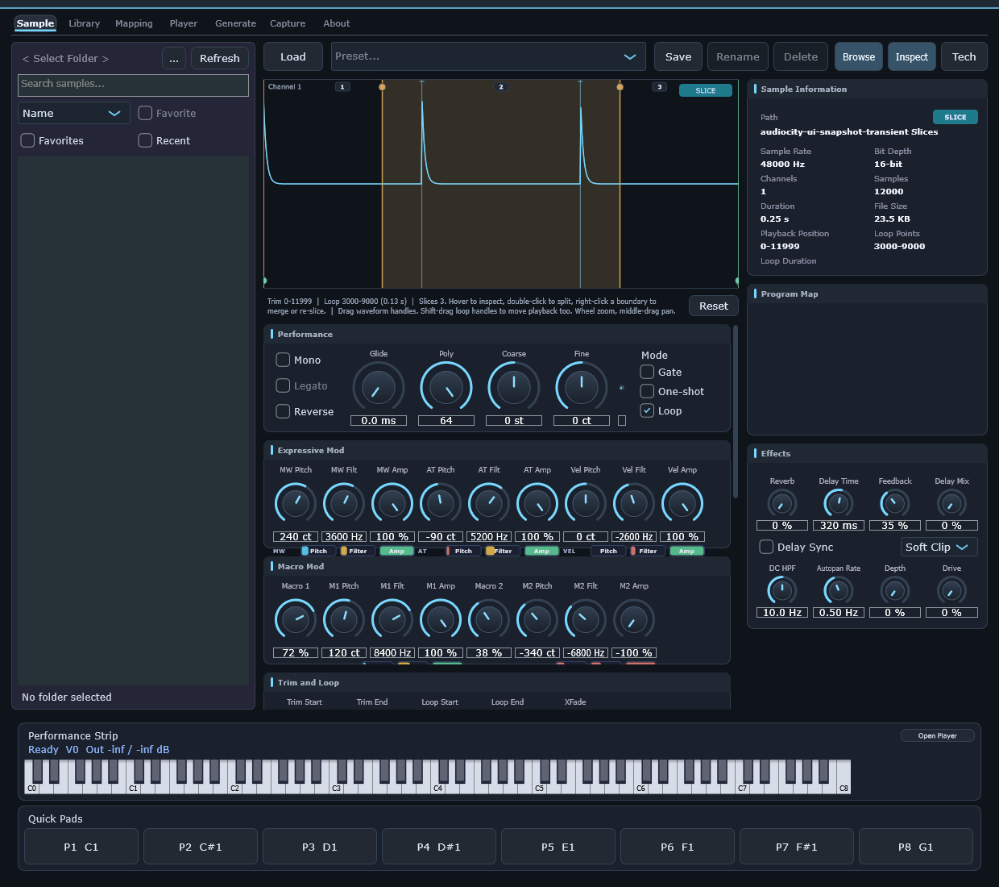
	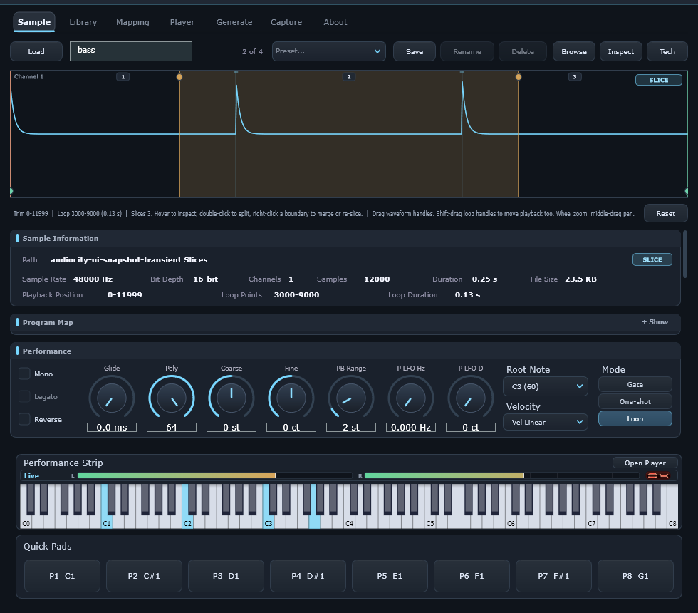
</p>

<p align="center">
	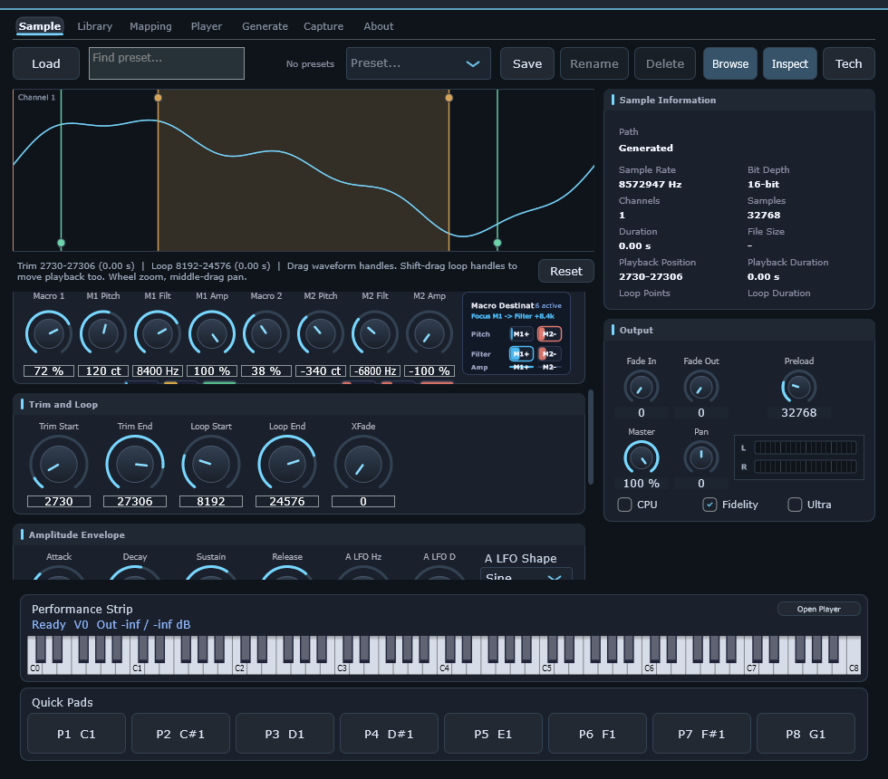
	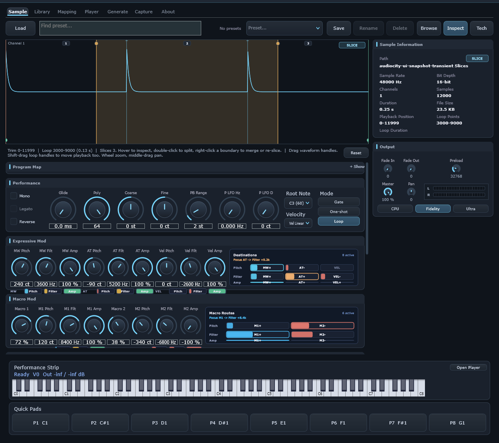
</p>

### Browser, Mapping, and Performance

<p align="center">
	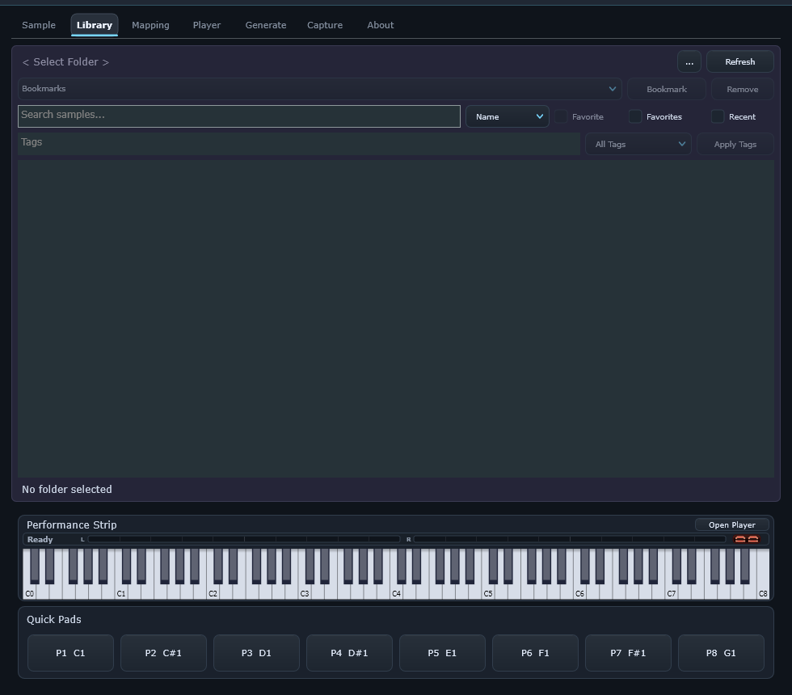
	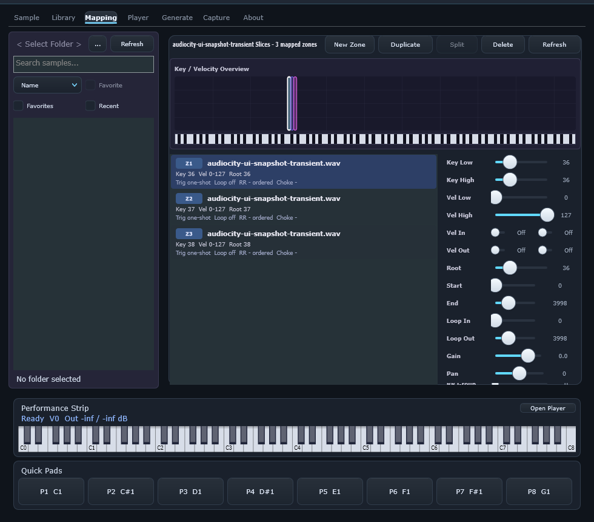
</p>

<p align="center">
	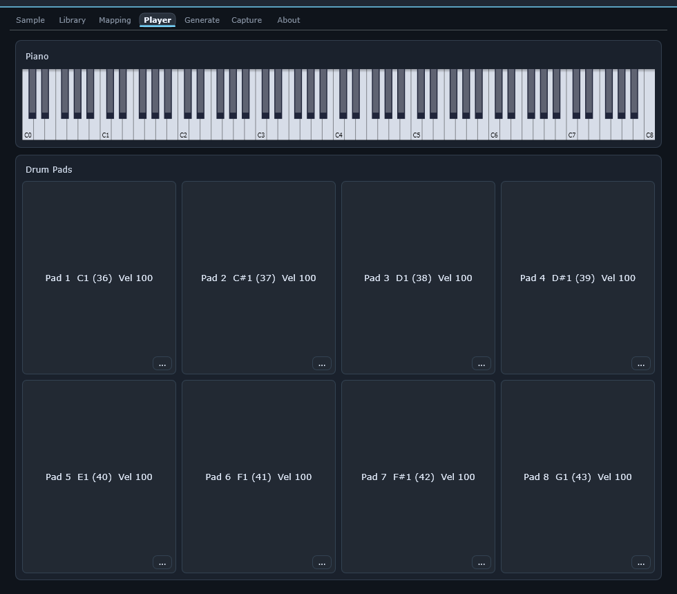
	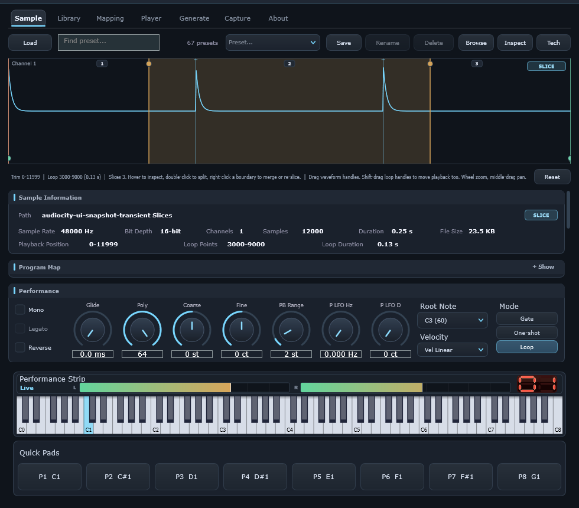
</p>

### Generate, Capture, and About

<p align="center">
	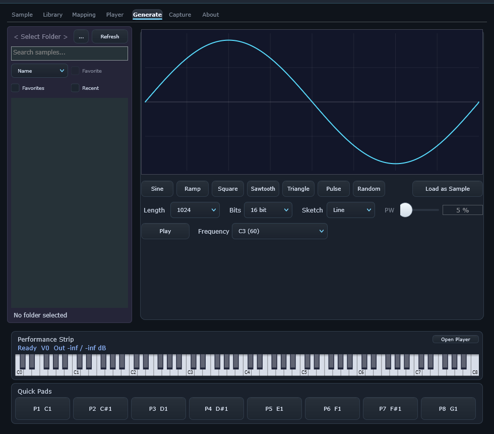
	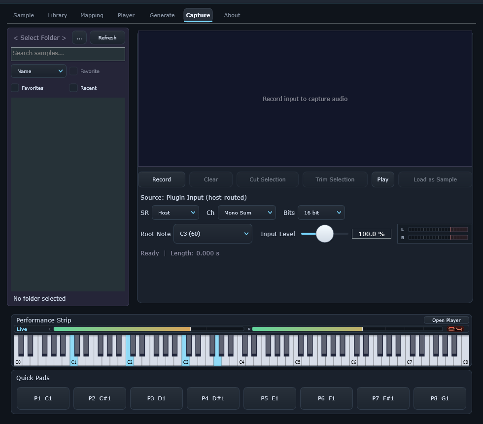
</p>

<p align="center">
	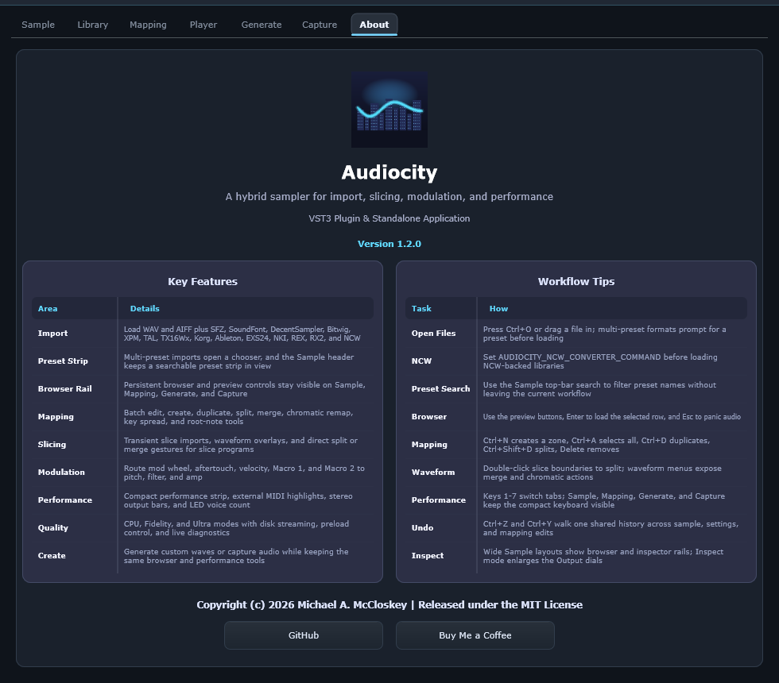
</p>

## Feature Highlights

- Browse the bundled 64-preset factory bank or import one-shots and multisample instruments from modern XML, ZIP, and legacy formats while keeping restore behavior deterministic.
- Preview and load from the browser rail without leaving the page you are editing.
- Search presets from the Sample header, then load or save `.acp` patches without switching tabs.
- Edit imported programs with mapping batch operations, slice workflows, and one shared undo history.
- Play from the full Player tab or the compact performance strip, with external MIDI note display and live voice or output status.
- Generate synthetic source material, capture audio, trim it, and move it into the same sampler workflow.
- Track preload, streaming, and playback diagnostics without touching the audio thread.

## Factory Presets and Auditioning

Audiocity now ships 64 bundled factory presets under `assets/factory_presets`, covering bass, lead, pad, pluck, keys, bell, ensemble, and FX categories. The presets embed their source audio so the same bank works in the standalone app, the VST3, the installer, and the portable package without any external sample dependency.

The content workflow is deterministic and test-backed:

- `tools/PresetAuthor.cpp` regenerates the factory bank.
- `tools/PresetAuditioner.cpp` renders the presets offline and writes reports under `artifacts/preset_audition/`.
- `tests/OfflineRenderTests.cpp` enforces loop-mode, modulation/filter coverage, and other factory-bank quality gates before release packaging.

## Supported Formats

- Direct sample load: WAV, AIFF, REX, RX2, and NCW through an external converter command.
- Imported instruments: SFZ, SF2, DecentSampler `.dspreset`, Bitwig `.multisample`, MPC `.xpm`, 1010music Bento, TAL Sampler, TX16Wx, Korg multisample ZIP, Korg `.kmp`, Ableton `.adv` and `.adg`, EXS24, and a validated legacy NKI subset.
- Detection-only diagnostics: protected or encrypted Kontakt content is identified and reported, but not imported.

## Support

Support the project: &#9749; [Buy Me A Coffee](https://buymeacoffee.com/theosopher)

## Build Requirements

| Dependency | Version |
| --- | --- |
| CMake | 3.22 or newer |
| Visual Studio | 2022 |
| Compiler | MSVC with C++20 support |
| JUCE | 8.0.4 |
| Inno Setup | 6.x, for release installer builds |

Optional:

- Steinberg ASIO SDK for ASIO-enabled builds
- An NCW conversion tool exposed through `AUDIOCITY_NCW_CONVERTER_COMMAND` if you want to load NCW-backed content

## Quick Start

Bootstrap the development build and run tests:

```powershell
./scripts/bootstrap.ps1
```

Manual development build:

```bash
cmake --preset default
cmake --build --preset default --config Debug --target Audiocity_All
cmake --build --preset default --config Debug --target audiocity_offline_tests audiocity_ui_snapshot_harness
ctest --test-dir build -C Debug --output-on-failure
```

## Engine Profiling

Capture a symbolized CPU sample run of the dedicated engine harness and write the raw trace, WPA CSV exports, and summarized hotspots under `build/tests/profile-runs/`:

```powershell
./scripts/profile_engine_harness.ps1
./scripts/profile_engine_harness.ps1 -Seconds 6 -Quality ultra -Voices 32 -BlockSize 64
```

The profiling script builds `audiocity_engine_profile` in `RelWithDebInfo` by default, captures CPU samples with the Visual Studio diagnostics collector, exports WPA tables, and resolves the harness module's hot addresses through `llvm-symbolizer`.

## Release Builds

Release artifacts are built from a dedicated self-contained preset. The release executable is linked with the static MSVC runtime so it is as self-contained as practical on Windows.

Configure and build the self-contained release binaries only:

```bash
cmake --preset release-selfcontained-asio
cmake --build --preset release-selfcontained-asio
```

Build the complete release package set:

```powershell
./scripts/build_release.ps1
```

Build the release package set without ASIO:

```powershell
./scripts/build_release.ps1 -DisableAsio
```

The release script derives the version from `CMakeLists.txt` and produces two artifacts in `output/`:

- `Audiocity-1.3.1.0-windows-x64-setup.exe`
- `Audiocity-1.3.1.0-windows-x64-portable.zip`

### Installer Behavior

The Inno Setup installer supports:

- per-user or per-machine installation
- Add/Remove Programs integration
- desktop shortcut creation
- Start Menu shortcuts for the standalone app
- automatic VST3 installation to the correct path for the selected install scope
- bundled factory presets for both the standalone app and the VST3 package

VST3 install locations:

- per-user: `%LOCALAPPDATA%\Programs\Common\VST3`
- machine-wide: `%CommonProgramFiles%\VST3`

### Portable Package

The portable zip contains:

- the standalone application files ready to run after extraction
- a `VST3/` subfolder containing `Audiocity.vst3`
- `PortableInstall.txt` with manual plugin install instructions
- bundled factory presets
- the MIT license

The plugin bundle is intentionally left in a separate subfolder so the end user can choose whether to copy it to the per-user or machine-wide VST3 location.

## VS Code Workflow

The workspace includes:

- Debug and Release launch configurations for the standalone app
- a debug launch configuration for the offline test runner
- build tasks for Debug and self-contained Release builds
- a `Release: Build Artifacts` task that runs the full release script

## Project Structure

```text
Audiocity/
├── artifacts/          # Generated preset audition and validation reports
├── assets/             # Icons, artwork, and factory presets
├── docs/               # Architecture, roadmap, RT rules, testing specs
├── installer/          # Inno Setup script and portable package docs
├── prompts/            # Milestone-oriented Copilot prompts
├── scripts/            # Bootstrap, cleanup, ASIO integration, release packaging
├── src/engine/         # EngineCore, streaming, importers, and engine-side utilities
├── src/plugin/         # PluginProcessor, PluginEditor, UI components, presets
├── tests/              # Offline render, packaging, and UI snapshot validation
├── third_party/        # JUCE, REX SDK, optional ASIO SDK
├── tools/              # Preset authoring, auditioning, and support utilities
├── CMakeLists.txt
└── CMakePresets.json
```

## Architecture Notes

Audiocity is designed around a single processor shared by standalone and VST3 targets.

- Audio thread: rendering, mixing, streaming requests, and strict real-time-safe execution
- UI thread: parameter editing, browser actions, import workflows, and diagnostic presentation
- Testing model: offline deterministic renders plus snapshot and packaging regression checks

Real-time rules are defined in `docs/02-real-time-rules.md`, and the higher-level architecture lives in `docs/01-architecture.md`.

## Cleanup

Remove rebuildable artifacts while preserving packaged release outputs:

```powershell
./scripts/cleanup_artifacts.ps1
./scripts/cleanup_artifacts.ps1 -IncludeOutput
```

With `-IncludeOutput`, packaged `.exe` and `.zip` artifacts at the output root are preserved.

## License

Copyright (c) 2026 Michael A. McCloskey. Audiocity is released under the MIT License. See `LICENSE`.
