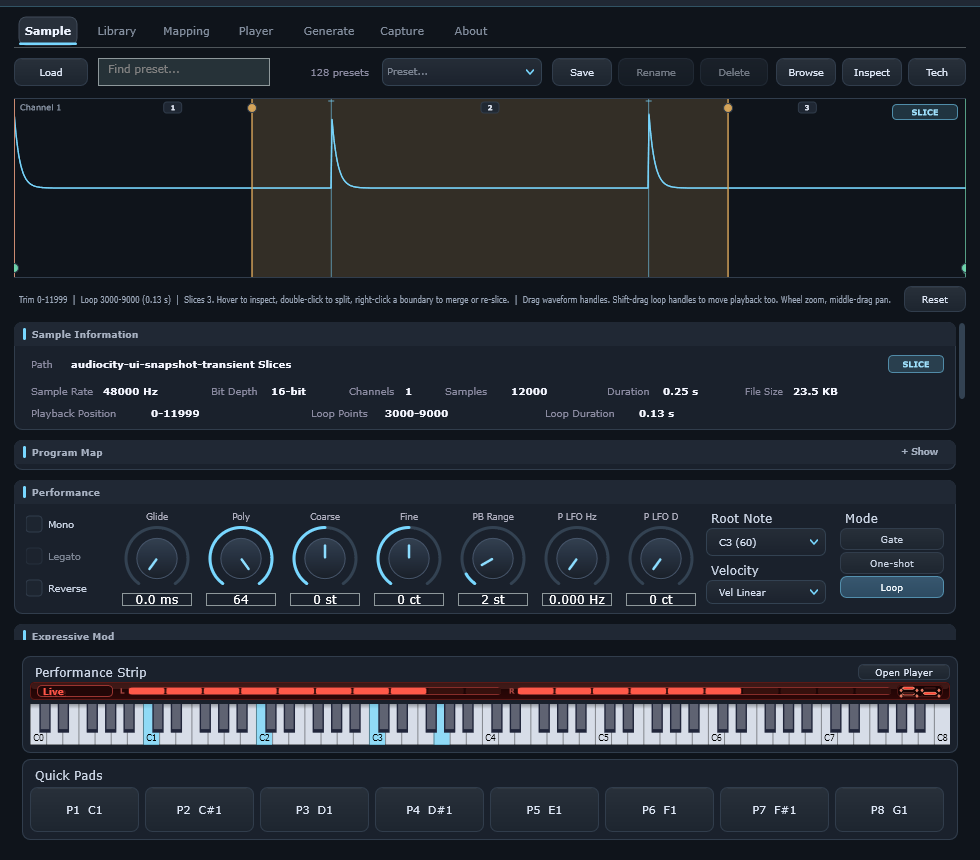
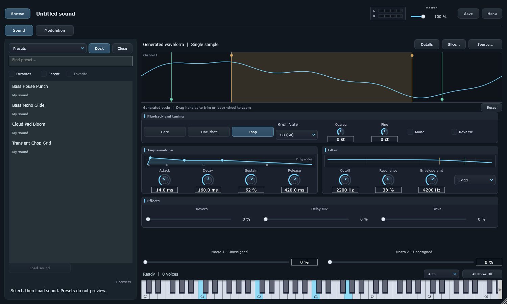

# Audiocity user guide

Turn any sound into an instrument.

Audiocity runs as a Windows standalone application or a VST3 instrument. The normal workflow is **find or create a sound → shape it → play it → save it**. The stock bank of 64 factory presets is available without setting up a sample folder. This guide describes the focused sampler interface introduced in September 2026.

## Make your first instrument

1. Open **Browse** and choose a factory preset, or drop a supported audio file into **Sound**. **Source…** also offers importing, recording and waveform generation.
2. For a single sample, set its **Root** note, choose **Gate**, **One-shot** or **Loop**, and adjust **Coarse** or **Fine** tuning.
3. Shape the amp envelope, filter and effects directly in Sound. Drag envelope nodes or adjust their controls; click a numeric value to enter it precisely.
4. Play from MIDI or the compact audition surface. Adjust the two macros when the sound has assignments.
5. Click **Save**. A new sound opens Save As. Choose a filename and folder; later saves go to that exact file. Factory sounds open Save As so the bundled bank stays intact.

The title identifies the current sound. An asterisk means it has been edited. Save, master level and stereo output meters stay in the header. The sound name and save destination survive editor reopening and project restore. A project created before this interface may show an untitled sound until you save a named preset.

## Find sounds in one browser

**Browse** opens a temporary overlay. At widths of 1400 pixels or more, **Dock** keeps it beside the instrument. If you make the window narrower, it returns to an overlay; the shaping sections stay in their usual order. Close hides it.

| Scope | Selecting an item | Committing the choice |
| --- | --- | --- |
| Presets | Selects a factory or user sound; it does not preview | **Load sound**, double-click or Enter replaces the current sound |
| Samples | Auditions the raw audio when **Auto preview** is enabled | **Replace sample**, double-click or Enter loads it into the sampler |
| Instruments | Selects an imported multisample file; it does not preview | **Load instrument**, double-click or Enter imports its mapping |

Search filters the current scope. **Favorites** and **Recent** narrow the results; **Favorite** toggles the selected item. User presets saved outside the normal preset bank appear through recent/favorite paths while those files exist. In Samples or Instruments, **Add folder** chooses the folder to scan and **Refresh** rescans it. Existing index and preview caches remain in use.

For raw samples, Preview/Stop and preview level are separate from loading and from master output. Preview is temporary audition audio; it does not become your MIDI instrument until you replace the sample. Presets and instruments require loading to hear their full mapped and processed sound.

A successful replacement keeps existing shaping settings where the established importer permits, while source-dependent root, region and playback defaults follow that source/importer. It is a source replacement, not a promise to retain every source boundary. A preset replaces saved sound settings. **Menu → Restore previous sound** recovers the prior instrument after either operation. Large instrument loads show their status; **Source / Cancel load** cancels an in-progress load. Starting another source workflow cancels a pending import.

## Shape the sound

Sound contains the waveform, playback and tuning, amp envelope, filter and essential effects. These fit without scrolling at the default **980 × 860** and minimum **980 × 720** logical window sizes.

For a single sample, drag the waveform handles to adjust the playback window or loop. Use the wheel to zoom and middle-drag to pan. **Reset** restores its ranges. **Details** provides exact frame positions, crossfade and fades when you need precision. Gate, One-shot and Loop retain their existing engine semantics; choosing One-shot does not automatically make the sound monophonic.

**Amp envelope** controls attack, decay, sustain and release. **Filter** exposes cutoff, resonance, envelope amount and type. **Effects** exposes reverb amount, delay mix and drive. Filter envelope timing and movement are under Modulation. Delay time/feedback/sync, autopan, saturation mode, glide, polyphony, pitch-bend range, velocity curve and pan are under Details.

For imported instruments, amp/filter/effects and tuning affect the whole instrument. Root notes, playback regions and playback behavior belong to individual zones. Sound explains this and offers **Edit zones**; it does not display ineffective global root/mode controls. The waveform is a reference sample for multisamples, not a waveform of the whole instrument. Imported mappings are retained until you deliberately edit them.

## Play and modulate

The audition selector offers **Auto**, **Keyboard**, **Pads** or **Hidden**. Auto shows pads for slice programs and keys for pitched sounds. Keyboard arrows reach other octaves. Pads send the existing eight note/velocity assignments; right-click a pad to change its assignment. Sources with more slices can be reached with MIDI or the keyboard. Hidden leaves MIDI/voice status and **All Notes Off** available.

The two macro values are always near the playing surface. Their names indicate their current destinations: Brightness, Pitch, Level, Multiple destinations or Unassigned. This naming is inferred from the existing routes; it does not alter host parameter identifiers.

Open **Modulation** to edit the existing relationships: mod wheel, pressure, velocity and two macros → pitch, filter cutoff or amplitude, with signed amounts in cents, Hz or percent. Scroll here for vibrato, tremolo, filter envelope, filter LFO, tempo sync and tracking. No new destinations or modulation engine have been added.

Right-click a dial's label for **MIDI CC Learn**. Move the controller to bind it. The label menu also clears or cancels learning. Existing MIDI expression, CC assignments and DAW automation remain compatible. Double-click a dial to reset it; Shift-wheel makes finer adjustments. Text entry in a value or search field takes precedence over instrument shortcuts.

## Create a source

**Source → Generate waveform…** opens the waveform shapes and drawing surface. Choose a shape or draw a cycle, set its pitch and audition it with **Preview**. Sketch smoothing and pulse width remain nearby. **Format settings** reveals sample-count and bit-depth choices. **Use sample** commits the generated source into Sound. **Cancel / return** or Esc stops the preview and leaves the current instrument intact.

**Source → Record sample…** opens recording. The standalone uses its configured input; the plugin uses the host-routed input. Record, stop, select a region, then preview it. Cut, trim and normalize operate on the take. Set the root note and input level; **Recording format** reveals rate, channel and bit-depth choices. **Use sample** commits the selection, or the entire take if there is no selection. Leaving this workflow stops recording/preview and retains the take for further work; it does not replace the instrument.

After either commit, **Restore previous sound** recovers the instrument that was open before the commit. Root-note changes are applied only when a recording commit succeeds.

## Slice and repair

Load a supported audio file, then choose **Slice… → Convert source to slices**. Conversion is explicit and keeps a recovery snapshot. It is currently available for file-backed single samples; generated/recorded sources and existing multisample programs are not silently converted. In the slice waveform, double-click to split and right-click near a boundary to merge. Undo/Redo handles boundary edits. **Restore previous sound** reverses the conversion itself.

**Menu → Advanced mapping / export** opens single-zone repair. Select a zone to adjust its note/velocity range, root, region, loop, gain, pan, trigger or loop behavior, then apply the edit. Zone deletion has Undo. **Export instrument** uses the existing SFZ/DecentSampler export path.

New Library, create/duplicate zone tools, exhaustive batch authoring, bulk tags and bookmark administration are retired from the visible workflow. Their removal does not strip round-robin groups, velocity fades, choke data, mappings or assets from existing instruments. Those data remain in playback, project state and supported exports.

## Save and recover

**Save** writes the current preset file. **Menu → Save preset as…** or Ctrl+Shift+S chooses a new destination. Single-sample presets embed their audio using the existing preset format; imported instruments retain their existing external-asset dependencies. Keep their samples available, or use the supported export/copy-samples workflow when moving libraries.

**Restore previous sound** is a one-step replacement history, available while the editor stays open. Repeated use swaps the current and previous sounds. It includes unsaved settings and mappings. Single-sample recovery embeds the current sample within the preset format's existing size/codec limits, allowing recovery after its original file moves. Imported-instrument recovery still depends on its assets. Undo/Redo handles shaping and mapping changes; replacement recovery is a separate Menu command. Continuous parameter edits are coalesced, and changes to different parameters form separate steps.

Unreadable/malformed presets leave the current sound intact. A preset whose source cannot restore rolls back to the prior state and reports the failure. Import cancellation/failure keeps the established prior-source behavior. Successful source changes can end held notes; trigger again after a replacement. This is not a seamless live patch-switching mode.

## Secondary settings and shortcuts

**Details** contains exact sample regions, voice/expression options, detailed effects, CPU/Fidelity/Ultra quality, preload, DC filtering, source information and import diagnostics. **Copy Log** copies diagnostic details for troubleshooting. **Menu** contains preset administration and About. In the standalone, the application's **Options** audio/MIDI setup remains available; a DAW handles those choices for VST3.

| Action | Shortcut |
| --- | --- |
| Import | Ctrl+O |
| Save / Save As | Ctrl+S / Ctrl+Shift+S |
| Undo / Redo | Ctrl+Z / Ctrl+Y or Ctrl+Shift+Z |
| Return to Sound / close browser or source workflow | Esc |
| Preview generated source | Space while Generate is open |
| Load selected browser item | Enter |
| Open Details | Ctrl+Alt+D |
| Delete selected mapping zone | Delete while the zone list has focus |

If there is no sound, check the current source, master level, MIDI input and output device. Use **All Notes Off** for stuck notes. For dropouts, increase the audio buffer or choose a lighter quality tier in Details. For missing or unsupported import content, read the diagnostic and keep original instrument assets with the program; renaming a file extension does not convert its format.

See the [supported-format list](../README.md#supported-formats), [engine architecture](01-architecture.md), [real-time rules](02-real-time-rules.md), and [simplification implementation notes](SAMPLER_SIMPLIFICATION_2026-09-07.md) for technical details.
