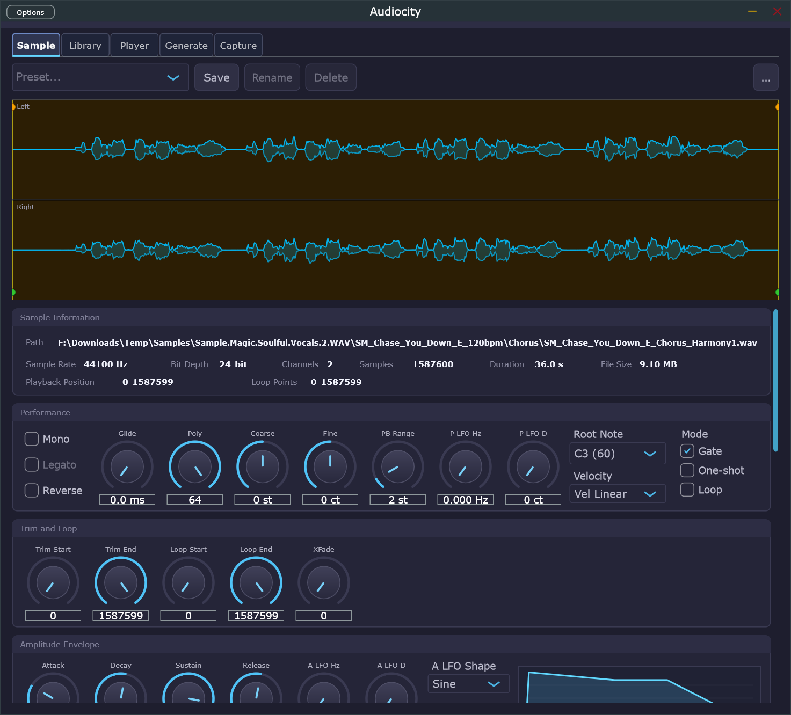
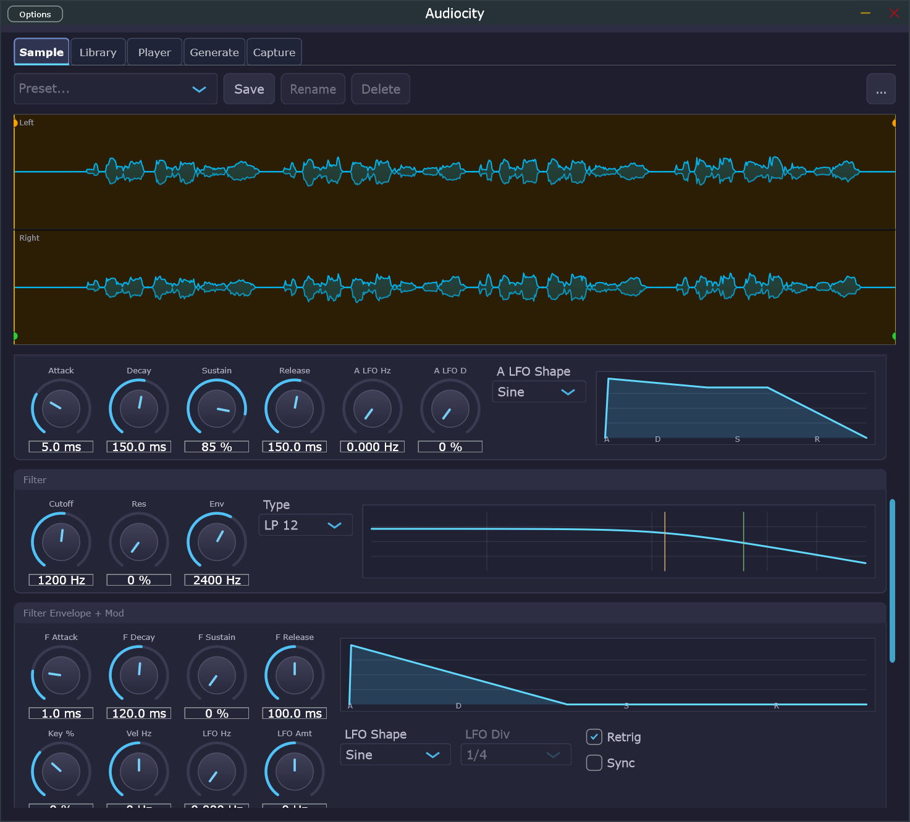
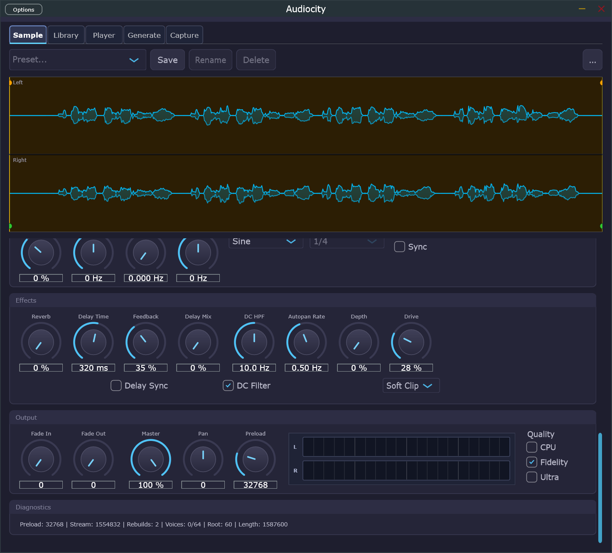
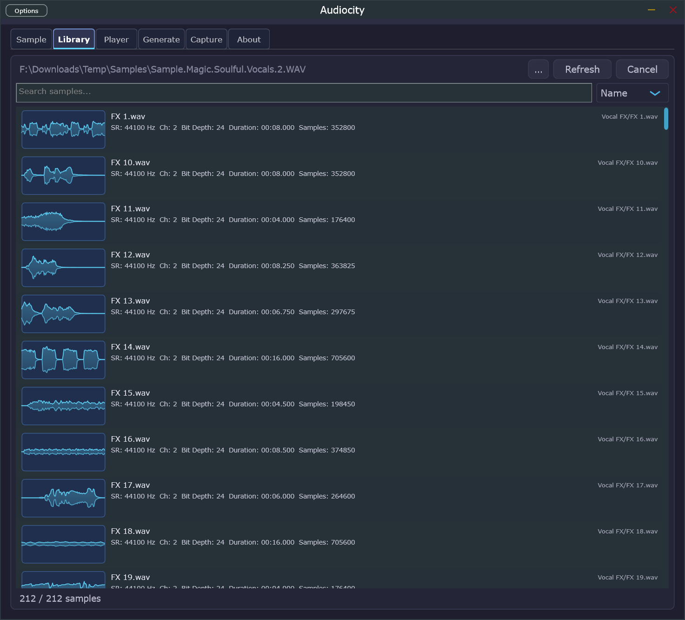
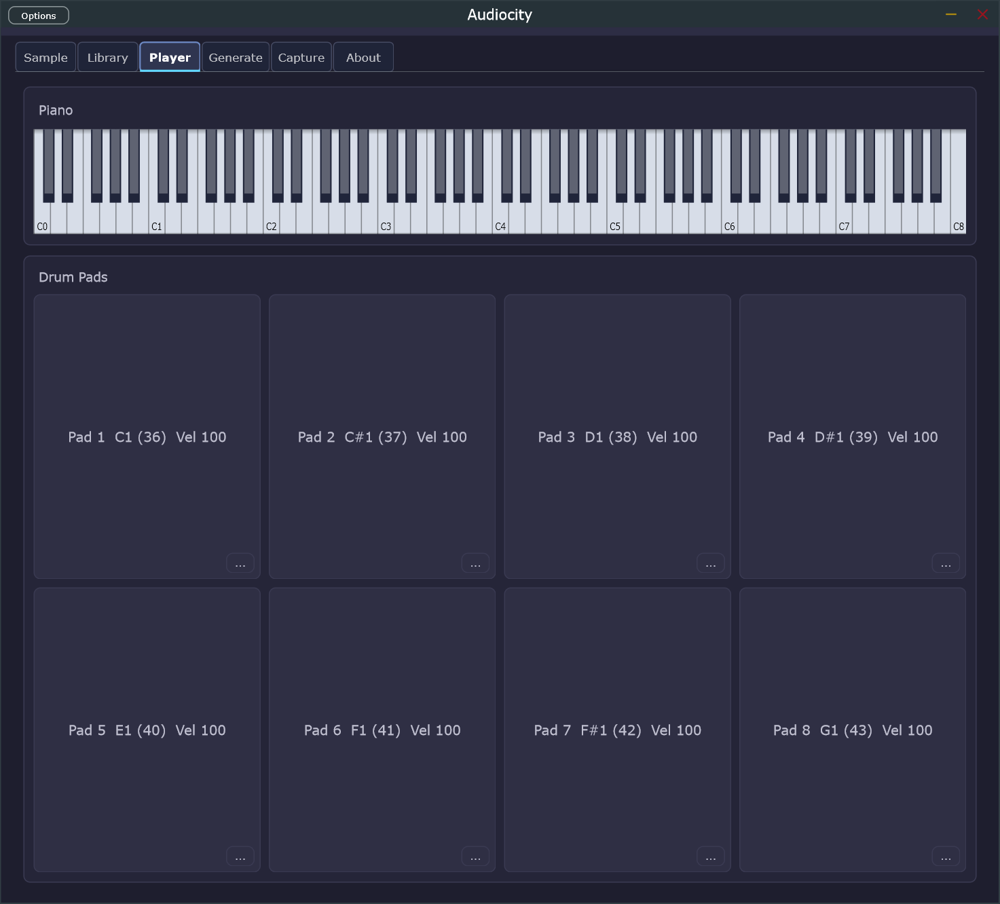
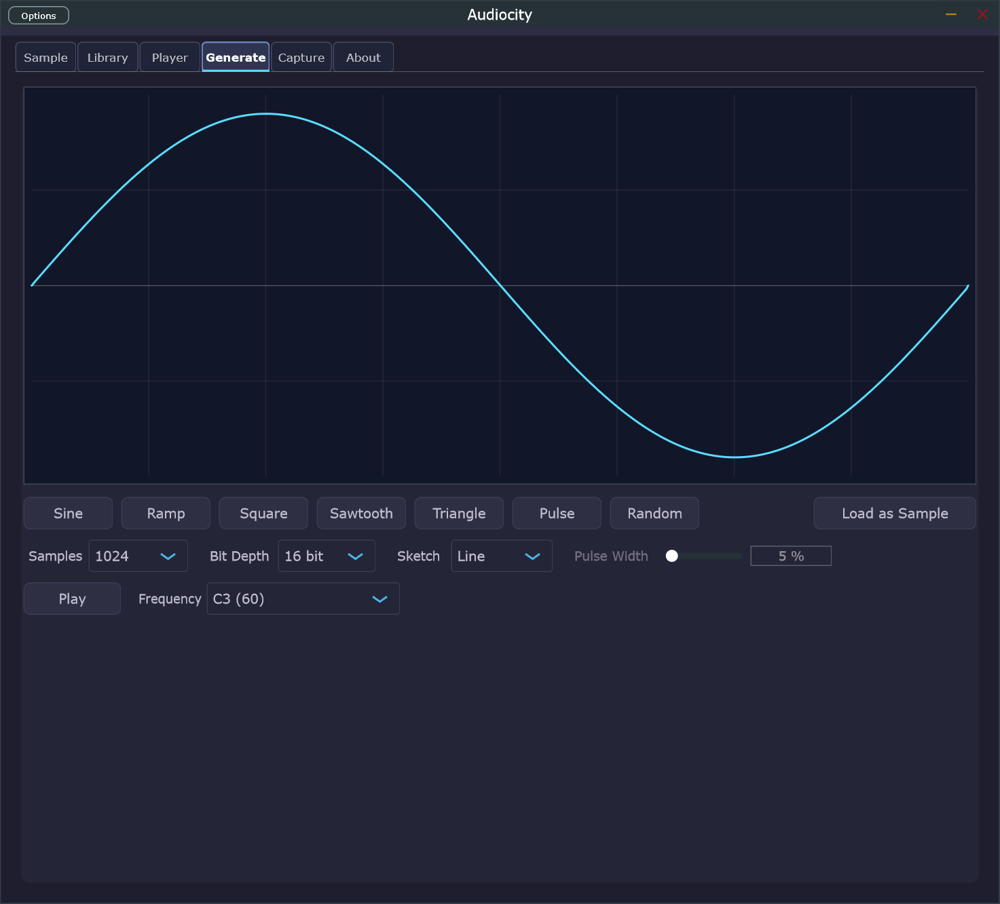
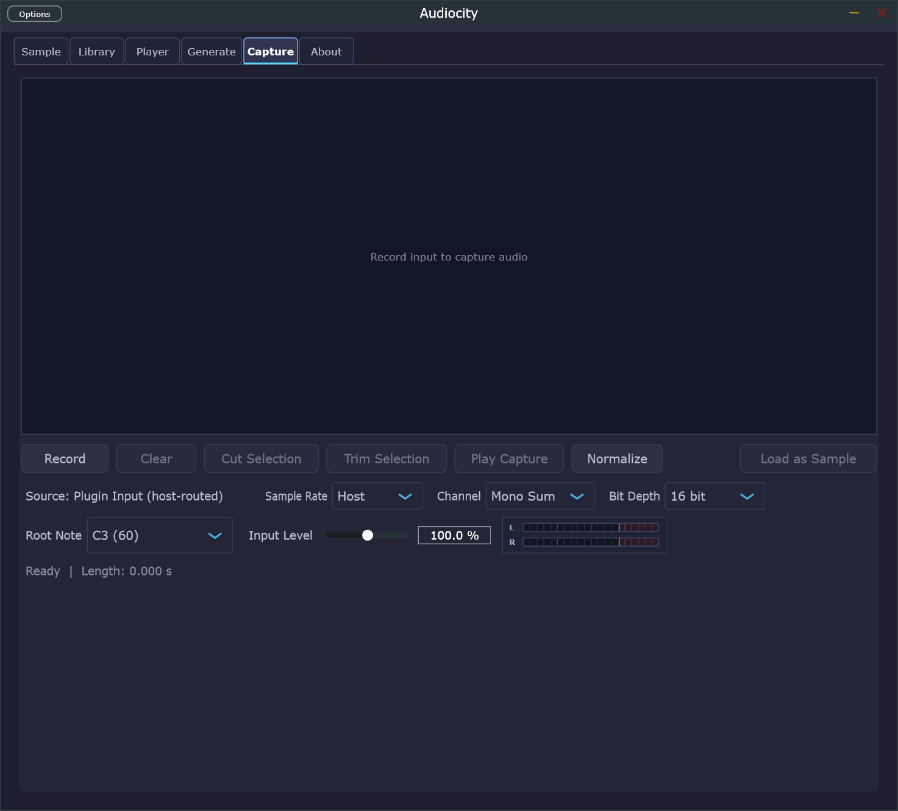

# Audiocity — User Guide


**Audiocity** is a high‑performance hybrid sampler built on JUCE and C++20. It ships as a Standalone Windows application and as a VST3 instrument plugin, both built from the same `AudioProcessor` core. This guide walks you through every tab, panel, knob, and workflow in the application.

> **Conventions used in this guide**
> - Screenshots are followed by a **numbered legend table**. Numbers in the table (① ② ③ …) refer to regions of the image, read left‑to‑right and top‑to‑bottom, grouped by the panel/section called out in the description column.
> - **Bold names** identify on‑screen labels exactly as they appear.
> - Knob ranges are written `min … max [unit] (default)`.
> - Text in *italics* indicates a value, mode name, or file path.

---

## Table of Contents

1. [What Audiocity Does](#1-what-audiocity-does)
2. [Installing and Launching](#2-installing-and-launching)
3. [Window Chrome and Common Layout](#3-window-chrome-and-common-layout)
4. [Sample Tab — The Instrument Editor](#4-sample-tab--the-instrument-editor)
   - 4.1 [Preset Bar](#41-preset-bar)
   - 4.2 [Waveform Display](#42-waveform-display)
   - 4.3 [Sample Information](#43-sample-information)
   - 4.4 [Performance Section](#44-performance-section)
   - 4.5 [Trim and Loop](#45-trim-and-loop)
   - 4.6 [Amplitude Envelope and Amp LFO](#46-amplitude-envelope-and-amp-lfo)
   - 4.7 [Filter](#47-filter)
   - 4.8 [Filter Envelope and Modulation](#48-filter-envelope-and-modulation)
   - 4.9 [Effects](#49-effects)
   - 4.10 [Output Section](#410-output-section)
   - 4.11 [Diagnostics Strip](#411-diagnostics-strip)
5. [Library Tab — Browsing Samples](#5-library-tab--browsing-samples)
6. [Player Tab — Keyboard and Drum Pads](#6-player-tab--keyboard-and-drum-pads)
7. [Generate Tab — Synthesizing Waveforms](#7-generate-tab--synthesizing-waveforms)
8. [Capture Tab — Recording Audio](#8-capture-tab--recording-audio)
9. [About Tab](#9-about-tab)
10. [Preset Workflow (`.acp` files)](#10-preset-workflow-acp-files)
11. [Importing Samples, SFZ, REX, and NKI](#11-importing-samples-sfz-rex-and-nki)
12. [MIDI Learn and Automation](#12-midi-learn-and-automation)
13. [Standalone Audio/MIDI Setup (Options)](#13-standalone-audiomidi-setup-options)
14. [Keyboard Shortcuts and Mouse Tips](#14-keyboard-shortcuts-and-mouse-tips)
15. [Troubleshooting](#15-troubleshooting)
16. [Appendix A — Architecture at a Glance](#appendix-a--architecture-at-a-glance)
17. [Appendix B — Parameter Quick Reference](#appendix-b--parameter-quick-reference)

---

## 1. What Audiocity Does

Audiocity loads WAV, AIFF, FLAC, and OGG audio samples, maps them across MIDI keys and velocities, and plays them back with multi‑voice polyphony, ADSR envelopes, filtering, modulation, and a small built‑in effects rack. It also imports SFZ instruments, REX/RX2 sliced loops, and a subset of legacy NKI patches, and provides on‑the‑spot tools to **generate** simple waveforms and **capture** live input as new samples.

Audiocity is delivered as:

- **Standalone app** — `Audiocity.exe`, with its own audio device and MIDI manager.
- **VST3 plugin** — `Audiocity.vst3`, hosted by any VST3‑capable DAW. The DAW provides audio routing, MIDI, and external effects.

Both targets share the same engine, so presets and behaviors are identical between them.

---

## 2. Installing and Launching

### 2.1 Standalone

Run the Inno Setup installer (or extract the portable zip) from the **Releases** page and launch `Audiocity.exe`. The first time the standalone runs it will choose a default audio device and MIDI input. Configure these later via the **Options** menu (see [§13](#13-standalone-audiomidi-setup-options)).

### 2.2 VST3

Copy `Audiocity.vst3` to your system VST3 folder, typically:

```
C:\Program Files\Common Files\VST3\
```

Rescan plugins in your DAW, then add **Audiocity** as an instrument on a MIDI track. The DAW supplies sample rate, block size, MIDI input, and audio routing.

### 2.3 First‑run sanity check

1. Open the **Player** tab.
2. Click any key on the on‑screen piano. You should hear the default tone (initially a generated sine; otherwise silence until a sample is loaded).
3. Drag a `.wav` file from Explorer onto the window (anywhere on the editor) — the file loads instantly into the **Sample** tab.

---

## 3. Window Chrome and Common Layout

All five primary tabs share the same window chrome. This screenshot of the **Sample** tab shows it.



| # | Region | Description |
| --- | --- | --- |
| ① | **Options** button (top‑left) | Standalone only. Opens JUCE's audio/MIDI settings dialog (input/output device, sample rate, buffer size, MIDI inputs). Hidden in the VST3 build because the DAW handles I/O. See [§13](#13-standalone-audiomidi-setup-options). |
| ② | **Title bar** (`Audiocity`) | Standard window title; double‑click to maximize, drag to move. The minimize / close glyphs are at the right edge. |
| ③ | **Tab bar** | Five primary tabs: **Sample**, **Library**, **Player**, **Generate**, **Capture**. The **About** tab is added in newer builds (visible when present). The active tab is highlighted in cyan. |
| ④ | **Preset bar** | Always visible on the **Sample** tab; manages `.acp` preset files. See [§4.1](#41-preset-bar). |

The bottom edge of the window is resizable; the editor adapts to wider/taller windows by revealing optional inspector rails and reflowing knobs.

---

## 4. Sample Tab — The Instrument Editor

The **Sample** tab is the heart of Audiocity. It is divided vertically into three scrollable bands; the screenshots below cover the top, middle, and bottom of one continuous page.

### 4.1 Preset Bar


| # | Control | What it does |
| --- | --- | --- |
| ① | **Preset…** combo box | Lists the `.acp` presets in your preset folder. Selecting one immediately loads that preset (sample reference + every editor parameter). The little funnel/`...` button at the far right of this row opens the preset filter. |
| ② | **Save** | Saves the current state as a new preset. Prompts for a name. Names are sanitized for the filesystem. |
| ③ | **Rename** | Renames the currently selected preset on disk. Disabled when no preset is selected. |
| ④ | **Delete** | Permanently deletes the selected `.acp` file (with confirmation). |
| ⑤ | **`...`** (far right) | Filter / search box for the preset list. Type to live‑filter the combo box contents. |

> Presets are stored under your Audiocity user data folder as XML payloads with a `.acp` extension. They embed sample paths (relative when possible) plus the full parameter snapshot.

#### Factory presets

Audiocity ships with a **stock bank of 64 factory presets** organised into eight families (Bass, Lead, Pad, Pluck, Keys, Bell, Ensemble, FX). Each factory preset embeds its own pre‑synthesized sample inside the `.acp` file, so the bank is fully self‑contained and portable across machines — no separate sample library is required.

The preset combo merges the factory bank with your personal user presets:

* Factory presets are discovered next to the installed Standalone executable (`FactoryPresets/`) and inside the VST3 bundle (`Contents/Resources/FactoryPresets/`). Development builds also pick them up from `assets/factory_presets` in the source tree.
* User presets live under `<UserData>/Audiocity/Presets/` and can be created, renamed, or deleted normally.
* If a user preset shares a name with a factory preset, the factory entry wins in the listing.
* **Rename** and **Delete** are disabled while a factory preset is selected; use **Save** to capture an edited factory sound as a new user preset.

### 4.2 Waveform Display

The two horizontal lanes labelled **Left** and **Right** show the loaded sample's stereo waveform.

| Region | What you see |
| --- | --- |
| Cyan/green outlines | The peak‑min/max envelope of the sample, computed by the peak‑preview cache. |
| Vertical orange marker (left edge) | Current **Trim Start** position (start of playback range). |
| Vertical green marker (right edge) | Current **Trim End** position (end of playback range). |
| Cyan vertical lines inside the waveform | **Loop Start** and **Loop End** markers (visible when the loop window differs from the trim window). |
| Faint vertical grid (slice mode) | When a sliced source is loaded (REX or auto‑sliced WAV), each slice boundary is drawn as a faint vertical line. |
| Tiny moving cursors | Per‑voice playback cursors, one per active voice (only visible while notes are sounding). |

#### Interactions

- **Click + drag** on a marker handle to move it; the dialed value below updates live.
- **Hold Shift while dragging** the loop start/end to keep the playback window locked to the loop.
- **Mouse wheel** zooms in/out around the cursor; **wheel + Shift** pans horizontally.
- **Double‑click** a blank area to reset the view.
- **Right‑click** in slice mode to **split** at the click position or **merge** an adjacent boundary. The context menu also offers **Auto‑slice** for non‑sliced sources.

A small **`Reset`** button below the waveform restores trim and loop ranges to *whole‑file* and clears any zoom.

### 4.3 Sample Information

This block is read‑only and reflects what is currently loaded.

| Field | Meaning |
| --- | --- |
| **Path** | Absolute or relative path of the source file. |
| **Sample Rate** | Sample rate of the source (e.g. 44100 Hz). Audiocity resamples on the fly. |
| **Bit Depth** | Source bit depth (8 / 16 / 24 / 32 / float). |
| **Channels** | 1 = mono, 2 = stereo. |
| **Samples** | Total frame count. |
| **Duration** | Source length in seconds. |
| **File Size** | Disk size of the source file. |
| **Playback Position** | Currently active **Trim Start … Trim End** range in samples. |
| **Loop Points** | Currently active **Loop Start … Loop End** range in samples. |

### 4.4 Performance Section


Reading the **Performance** band left‑to‑right:

| # | Control | Range / values | What it does |
| --- | --- | --- | --- |
| ① | **Mono** toggle | on/off | When on, only one voice sounds at a time per program. |
| ② | **Legato** toggle | on/off | In Mono mode, overlapping notes do not retrigger envelopes; pitch glides between them per **Glide**. |
| ③ | **Reverse** toggle | on/off | Plays the sample tail‑to‑head. |
| ④ | **Glide** dial | 0 … 2000 ms (0) | Portamento time between notes (mono/legato). 0 = instant. |
| ⑤ | **Poly** dial | 1 … 64 voices (64) | Maximum simultaneous voices per program. When exceeded, the oldest/quietest voice is stolen. |
| ⑥ | **Coarse** dial | −24 … +24 st (0) | Pitch transpose in semitones. |
| ⑦ | **Fine** dial | −100 … +100 ct (0) | Fine pitch trim in cents. |
| ⑧ | **PB Range** dial | 0 … 24 st (2) | Pitch‑bend wheel range, in semitones either side of centre. |
| ⑨ | **P LFO Hz** dial | 0 … 40 Hz (0) | Pitch LFO rate (vibrato speed). 0 = off. |
| ⑩ | **P LFO D** dial | 0 … 100 ct (0) | Pitch LFO depth in cents. |
| ⑪ | **Root Note** combo | C‑1 … G9 (C3 / 60) | The MIDI note at which the sample plays at unity pitch. Other notes resample relative to this. |
| ⑫ | **Velocity** combo | *Vel Linear*, *Vel Soft*, *Vel Hard*, *Vel Fixed* | Velocity response curve. *Fixed* sends every note at full velocity. |
| ⑬ | **Mode → Gate** | exclusive | Note plays while held; releases on note‑off (default). |
| ⑭ | **Mode → One‑shot** | exclusive | Plays from start to end regardless of how long the key is held. |
| ⑮ | **Mode → Loop** | exclusive | Loops the loop window for as long as the key is held (and beyond, if combined with sustain‑style envelopes). |

> Gate, One‑shot, and Loop are mutually exclusive. Selecting one deselects the others.

### 4.5 Trim and Loop

| # | Control | Units | What it does |
| --- | --- | --- | --- |
| ① | **Trim Start** | sample frame | Start of the playback range. Cannot exceed Trim End. |
| ② | **Trim End** | sample frame | End of the playback range. Defaults to last sample. |
| ③ | **Loop Start** | sample frame | Beginning of the loop window. Must lie within the trim range. |
| ④ | **Loop End** | sample frame | End of the loop window. Must lie within the trim range. |
| ⑤ | **XFade** | 0 … 5000 frames (0) | Crossfade length applied at the loop seam (smooths abrupt loop joins). |

These dials mirror the markers in the waveform; dragging in the waveform updates them and vice‑versa.

### 4.6 Amplitude Envelope and Amp LFO



| # | Control | Range (default) | What it does |
| --- | --- | --- | --- |
| ① | **Attack** | 0.1 … 5000 ms (5) | Time from note‑on to peak amplitude. |
| ② | **Decay** | 0.1 … 5000 ms (150) | Time from peak to sustain level. |
| ③ | **Sustain** | 0 … 100 % (85) | Held level while the note is on. |
| ④ | **Release** | 0.1 … 5000 ms (150) | Time from note‑off to silence. |
| ⑤ | **A LFO Hz** | 0 … 40 Hz (0) | Amplitude LFO (tremolo) rate. |
| ⑥ | **A LFO D** | 0 … 100 % (0) | Tremolo depth. |
| ⑦ | **A LFO Shape** combo | *Sine*, *Triangle*, *Square*, *Saw Up*, *Saw Down*, *Random S/H* | Tremolo waveshape. |
| ⑧ | **A‑D‑S‑R graph** (right) | interactive | The shaded curve mirrors the four ADSR dials. **Click + drag** the corner handles to edit the envelope visually; the dials follow. |

### 4.7 Filter

| # | Control | Range (default) | What it does |
| --- | --- | --- | --- |
| ① | **Cutoff** | 20 … 20000 Hz (18000) | Filter cutoff frequency. |
| ② | **Res** | 0 … 100 % (0) | Filter resonance / Q. High values can self‑oscillate. |
| ③ | **Env** | −12000 … +12000 Hz (0) | How far the filter envelope modulates the cutoff. Negative values invert. |
| ④ | **Type** combo | *LP 12*, *LP 24*, *HP 12*, *HP 24*, *BP*, *Notch* | Filter topology and slope (12 = 1‑pole, 24 = 2‑pole equivalent). |
| ⑤ | **Filter response graph** | live | Plots the current frequency response. The orange tick marks the static cutoff; the cyan tick marks the envelope‑modulated cutoff. |

### 4.8 Filter Envelope and Modulation

| # | Control | Range (default) | What it does |
| --- | --- | --- | --- |
| ① | **F Attack** | 0.1 … 5000 ms (1) | Filter envelope attack. |
| ② | **F Decay** | 0.1 … 5000 ms (120) | Filter envelope decay. |
| ③ | **F Sustain** | 0 … 100 % (0) | Filter envelope sustain. |
| ④ | **F Release** | 0.1 … 5000 ms (100) | Filter envelope release. |
| ⑤ | **F‑ADSR graph** | interactive | Same edit semantics as the amp envelope graph. |
| ⑥ | **Key %** | −100 … +200 % (0) | Keyboard tracking of cutoff. 100 % = one octave of cutoff per octave played. |
| ⑦ | **Vel Hz** | −12000 … +12000 Hz (0) | Velocity → cutoff offset in Hz at full velocity. |
| ⑧ | **LFO Hz** | 0 … 40 Hz (0) | Filter LFO rate. |
| ⑨ | **LFO Amt** | −20000 … +20000 Hz (0) | Filter LFO depth, in Hz of cutoff. |
| ⑩ | **LFO Shape** combo | as Amp LFO | Filter LFO waveshape. |
| ⑪ | **LFO Div** combo | *1/1, 1/2, 1/4, 1/8, 1/16, 1/32* (and dotted/triplet variants) | Tempo‑synced division when **Sync** is on. |
| ⑫ | **Retrig** toggle | on/off | When on, the filter LFO restarts on every note‑on. |
| ⑬ | **Sync** toggle | on/off | Lock filter LFO rate to host tempo using **LFO Div**. |

Additional filter‑mod knobs (visible when the panel is wider): **LFO Phase** (start phase 0…360°), **LFO Rand** (start‑phase randomization 0…180°), **LFO Fade** (fade‑in time 0…5000 ms), **Key Sync** (tempo‑synced rate scaled by key), **Key Lin** (linear keytrack), **Uni** (unipolar LFO instead of bipolar), **LFO Rate %** and **LFO Key %** (keytracking of the LFO rate and amount respectively).

### 4.9 Effects



| # | Control | Range (default) | What it does |
| --- | --- | --- | --- |
| ① | **Reverb** | 0 … 100 % (0) | Wet level of the built‑in plate‑style reverb. |
| ② | **Delay Time** | 1 … 2000 ms (320) | Tap delay time. When **Delay Sync** is on, snaps to host‑synced divisions instead. |
| ③ | **Feedback** | 0 … 95 % (35) | Delay feedback amount. Capped below self‑oscillation. |
| ④ | **Delay Mix** | 0 … 100 % (0) | Wet/dry blend for the delay. |
| ⑤ | **DC HPF** | 5 … 20 Hz (10) | Cutoff of the inline DC high‑pass filter (active when **DC Filter** is on). |
| ⑥ | **Autopan Rate** | 0.01 … 20 Hz (0.5) | Stereo autopan LFO speed. |
| ⑦ | **Depth** | 0 … 100 % (0) | Autopan depth. 0 = off. |
| ⑧ | **Drive** | 0 … 100 % (0) | Saturation drive amount. |
| ⑨ | **Soft Clip** combo | *Soft Clip*, *Hard Clip*, *Tube*, *Tape*, *Off* | Saturation algorithm. |
| ⑩ | **Delay Sync** toggle | on/off | Locks **Delay Time** to host tempo. |
| ⑪ | **DC Filter** toggle | on/off | Enables the DC blocker. Recommended **on** for asymmetric or sub‑heavy sources. |

### 4.10 Output Section

| # | Control | Range (default) | What it does |
| --- | --- | --- | --- |
| ① | **Fade In** | 0 … 10000 frames (0) | Sample‑accurate fade‑in applied at the start of every note. |
| ② | **Fade Out** | 0 … 10000 frames (0) | Sample‑accurate fade‑out applied at the end of every note. |
| ③ | **Master** | 0 … 100 % (100) | Final output level (post‑effects). |
| ④ | **Pan** | −100 … +100 (0) | Master pan. |
| ⑤ | **Preload** | 256 … 131072 frames (32768) | Number of frames preloaded for streamed playback. Larger values = lower disk pressure but more RAM. |
| ⑥ | **L / R peak meters** | dBFS | Stereo output meters with peak hold. The faint red zone at the right edge marks 0 dBFS clipping when the **CPU/Fidelity/Ultra** quality tier permits it. |
| ⑦ | **Quality → CPU** | exclusive | Lowest CPU cost; linear interpolation. |
| ⑧ | **Quality → Fidelity** | exclusive | Default. Higher‑quality interpolation. |
| ⑨ | **Quality → Ultra** | exclusive | Windowed‑sinc resampling for the cleanest pitch shift. Highest CPU. |

### 4.11 Diagnostics Strip

A single status line at the bottom of the **Sample** tab shows live engine metrics:

```
Preload: 32768 | Stream: 1554832 | Rebuilds: 2 | Voices: 0/64 | Root: 60 | Length: 1587600
```

| Field | Meaning |
| --- | --- |
| **Preload** | Frames currently held in RAM for the loaded sample. |
| **Stream** | Frames being streamed from disk (0 if fully preloaded). |
| **Rebuilds** | How many times the preload window has been rebuilt this session. |
| **Voices** | Active / maximum voices. |
| **Root** | Current root MIDI note. |
| **Length** | Total source frame count. |

Toggle the diagnostics strip with the **`Tech`** button (visible when the editor window is tall enough).

---

## 5. Library Tab — Browsing Samples



The **Library** tab is a high‑throughput sample browser with peak‑preview thumbnails and metadata.

| # | Control | What it does |
| --- | --- | --- |
| ① | **Root path label** (top‑left) | Displays the current scan root. |
| ② | **`...`** (top‑right of label) | Pick a new folder to scan. The library indexes all supported files recursively. |
| ③ | **Refresh** | Rescans the current root, picking up additions/removals. |
| ④ | **Cancel** | Stops a running scan. |
| ⑤ | **Search box** | Live‑filters the visible list by file name and (when present) tags. |
| ⑥ | **Sort combo** (*Name*) | Sort key for the list: *Name*, *Date*, *Size*, *Duration*, *Sample Rate*, *Channels*. |
| ⑦ | **Result list** | Each row shows a peak‑envelope thumbnail on the left, file name, and a one‑line metadata strip (`SR`, `Ch`, `Bit Depth`, `Duration`, `Samples`). The right column shows the relative path inside the library root. |
| ⑧ | **Status footer** (`212 / 212 samples`) | Visible / total sample counts in the current view. |

#### Interactions

- **Single‑click** a row to **preview** the sample through the main output (transient preview voice).
- **Double‑click** a row to **load** it into the **Sample** tab as the active source.
- **Right‑click** a row for: *Add to Favorites*, *Remove from Favorites*, *Apply Tags…*, *Reveal in Explorer*.
- The **Favorites** and **Recent** toggles (visible in wider window layouts) filter the list to your starred items or recent loads. A small **Bookmark** combo lets you save the current root path for one‑click return.

> Library indexing happens off the audio thread. Peak‑preview thumbnails are cached on disk and invalidated automatically when the source library changes.

---

## 6. Player Tab — Keyboard and Drum Pads



The **Player** tab gives you mouse and keyboard‑typing access to the loaded program plus an 8‑pad bank for drum‑style triggering.

| # | Region | Description |
| --- | --- | --- |
| ① | **Piano** keyboard | A scrollable 128‑note MIDI keyboard. Click white/black keys to play them. The active range and labels (C0…C8) follow the window width. |
| ② | **C0…C8 octave labels** | Inline labels under the keyboard for orientation. |
| ③ | **Drum Pads** grid | Eight large pads in a 2 × 4 layout. Each pad is fixed‑mapped by default to MIDI notes 36…43 (C1…G1) at velocity 100. |
| ④ | **Pad title strip** (e.g. *Pad 1 C1 (36) Vel 100*) | Shows the pad number, note name, MIDI number, and current trigger velocity. |
| ⑤ | **`...`** in the pad's bottom‑right | Opens the **Pad Assignment** dialog: pick a different MIDI note, change velocity, or assign a separate sample to that pad. |

#### Interactions

- **Click + hold** a pad/key to play it (gate behavior); release to stop.
- **Right‑click** a pad to clear its assignment.
- The QWERTY computer keyboard is mapped to the on‑screen piano while it has focus (`A` … `K` → octave around middle C, `W E T Y U` for the black keys). Press `Z`/`X` to shift the keyboard down/up by one octave.

---

## 7. Generate Tab — Synthesizing Waveforms



The **Generate** tab synthesizes simple single‑cycle waveforms or lets you sketch one freehand, then loads the result into the **Sample** tab as the active source.

| # | Control | What it does |
| --- | --- | --- |
| ① | **Waveform display** (top) | Live preview of the current waveform. **Click + drag** inside the display to sketch a custom waveform freehand; the **Sketch** combo controls how points are interpolated. |
| ② | **Sine / Ramp / Square / Sawtooth / Triangle / Pulse / Random** buttons | One‑click generators that overwrite the display with the named shape. |
| ③ | **Load as Sample** | Commits the current waveform to the **Sample** tab as a new in‑memory source, ready to be played, edited, or saved as a preset. |
| ④ | **Samples** combo | Length of the generated buffer in frames: *256, 512, 1024, 2048, 4096, 8192, 16384*. Longer = smoother but more RAM. |
| ⑤ | **Bit Depth** combo | Quantization depth applied to the generated samples: *8 bit, 16 bit, 24 bit, 32 bit float*. |
| ⑥ | **Sketch** combo | Interpolation between sketch points: *Line* (linear) or *Curve* (smoothed). |
| ⑦ | **Pulse Width** slider | 1 … 99 % (5). Active for the **Pulse** generator. |
| ⑧ | **Play** | Auditions the current waveform at the **Frequency** combo's pitch through the main output. |
| ⑨ | **Frequency** combo | Pitch at which the buffer is auditioned (named MIDI notes from C1 to C8). |

> The boundary samples of any sketched waveform are forced to zero‑crossings on commit to avoid clicks when looped at audio rate.

---

## 8. Capture Tab — Recording Audio



The **Capture** tab records audio input — from your audio interface (standalone) or from the host's plugin input bus (VST3) — and lets you trim, normalize, and load the result as a sample.

| # | Control | What it does |
| --- | --- | --- |
| ① | **Capture display** | Live waveform of the current take. **Click + drag** to set a selection range used by *Cut Selection*, *Trim Selection*, and *Play Capture*. |
| ② | **Record** | Starts/stops recording. While recording, the display scrolls and the input meter is active. |
| ③ | **Clear** | Discards the current take. |
| ④ | **Cut Selection** | Removes the selected range from the take, joining the surrounding audio. |
| ⑤ | **Trim Selection** | Keeps only the selected range and discards everything outside it. |
| ⑥ | **Play Capture** | Auditions the take through the main output. Use the selection to audition only a region. |
| ⑦ | **Normalize** | Scales the take so its peak reaches 0 dBFS without clipping. |
| ⑧ | **Load as Sample** | Commits the take to the **Sample** tab as a new in‑memory source. |
| ⑨ | **Source label** | Identifies the input being recorded. In the VST3 build this is *Plugin Input (host‑routed)*; standalone shows the active audio device's input. |
| ⑩ | **Sample Rate** combo | *Host* (uses the engine rate) or a fixed rate (44.1, 48, 88.2, 96 kHz). |
| ⑪ | **Channel** combo | *Mono Sum* (sums L+R), *Left Only*, *Right Only*, *Stereo*. |
| ⑫ | **Bit Depth** combo | Quantization stored in the take buffer. |
| ⑬ | **Root Note** combo | Root note tagged onto the resulting sample when **Load as Sample** is pressed. |
| ⑭ | **Input Level** slider | Pre‑record gain trim (0 … 200 %, default 100 %). |
| ⑮ | **L / R input VU meter** | Stereo peak meter for the input bus, with red‑zone clip indication. |
| ⑯ | **Status line** (`Ready | Length: 0.000 s`) | Recording state and the duration of the current take. |

---

## 9. About Tab

The **About** tab (visible when present) shows the application icon, version, license summary, and two action buttons:

- **GitHub** — opens the project repository in your browser.
- **Buy Me a Coffee** — opens the support page.

---

## 10. Preset Workflow (`.acp` files)

A preset captures **everything** the editor controls — the loaded sample reference, every dial, every toggle, mappings, modulation routes, and effect settings.

Workflow:

1. Build the sound you want.
2. Press **Save** in the preset bar.
3. Type a name (illegal filename characters are stripped).
4. The preset becomes the current selection in the **Preset…** combo.

To revisit a preset, choose it from the combo. To **rename** or **delete**, select it first and press the corresponding button. Use the search box (`...` at the far right) to filter long preset lists.

Presets live as XML payloads (`.acp` extension) under your user data folder; they are portable and can be shared by copying the file plus the referenced sample(s).

---

## 11. Importing Samples and Instruments

Audiocity recognizes the following file types. Drag a supported type onto the editor window to import it; diagnostic-only entries report why they cannot be loaded:

| Type | Behavior |
| --- | --- |
| `.wav`, `.aif`, `.aiff`, `.flac`, `.ogg` | Loads as a single sample. The file's embedded loop and root‑note metadata are honored when present. |
| `.ncw` | Loads through the converter named by `AUDIOCITY_NCW_CONVERTER_COMMAND`; Audiocity shows a setup diagnostic when no converter is configured. |
| `.sfz` | Runs the SFZ pre‑processor and importer (`#include`, `#define`, core opcode subset). Produces a multi‑zone imported program with key/velocity ranges, round‑robin groups, loop modes, gain/pan/tune, choke groups (`off_by`), and SFZ velocity crossfades. |
| `.rex`, `.rx2` | Decoded by the bundled REX runtime; each slice becomes its own playable region mapped chromatically from MIDI note 36. |
| `.nki` | A subset of legacy NKI patches with discrete external samples is supported. Container‑style NKIs are flagged in the diagnostics line. |
| `.sf2`, `.dspreset`, `.multisample`, `.xpm` | Imports SoundFont, DecentSampler, Bitwig, and MPC keygroup programs. |
| `preset.xml`, `.talsmpl`, `.txprog` | Imports 1010music Bento, TAL Sampler, and TX16Wx programs. Only a file named exactly `preset.xml` is treated as Bento content. |
| `.korgmultisample`, `.kmp`, `.adv`, `.adg` | Imports Korg multisamples/KMP programs and Ableton Sampler presets. |
| `.dexpreset`, `.exs` | Imports disting EX and EXS24 programs. |
| `.sxt` | Recognized as Reason NN-XT for a specific diagnostic; import is not yet supported. |

#### Auto‑slice

For ordinary WAV/AIFF loops you can choose **Auto‑slice** from the waveform's right‑click menu. Audiocity runs transient detection, places slice markers, and converts the source into a sample‑derived slice program — playable like a REX file.

#### Mapping edits

When a multi‑zone program is loaded, the **Mapping** controls in the editor let you adjust each zone's key range, velocity range, root, sample window, loop window, gain, pan, round‑robin group/position/mode, choke group, trigger mode, and loop mode. Mapping edits ride a unified undo/redo history shared with sample and parameter edits.

---

## 12. MIDI Learn and Automation

Every dial in Audiocity is a **CcLearnDial** — it can be bound to a MIDI CC.

To bind a dial:

1. **Right‑click** the dial.
2. Choose **MIDI Learn**.
3. Move a control on your MIDI device. The next incoming CC is bound.
4. Right‑click again and choose **Forget MIDI** to unbind.

In the VST3 build, every dial is also exposed as an automatable host parameter, so the same controls show up in your DAW's parameter list and automation lanes.

The **Player** tab's **Modulation** panel (when present in the layout) provides routing for **Mod Wheel**, **Aftertouch**, **Velocity**, and two host‑automatable **Macros**, each with separate amounts to **Pitch (cents)**, **Filter (Hz)**, and **Amp (%)** destinations.

---

## 13. Standalone Audio/MIDI Setup (Options)

In the standalone build, click **Options** (top‑left) to open JUCE's audio device dialog. From there you can choose:

- **Output / Input device** (WASAPI, DirectSound, ASIO when built with the Steinberg ASIO SDK).
- **Sample rate** and **buffer size**.
- **Active MIDI inputs** (each enabled input is merged into the engine).

For the lowest latency on Windows, prefer ASIO (when available) and a small buffer (e.g. 128 frames at 48 kHz). The standalone remembers these settings between launches.

> The VST3 build hides **Options** because the DAW handles audio/MIDI routing.

---

## 14. Keyboard Shortcuts and Mouse Tips

| Where | Action | Shortcut |
| --- | --- | --- |
| Anywhere | Undo | `Ctrl + Z` |
| Anywhere | Redo | `Ctrl + Shift + Z` or `Ctrl + Y` |
| Player keyboard | Octave down / up | `Z` / `X` |
| Player keyboard | Play notes | `A S D F G H J K` (whites) and `W E T Y U` (blacks) |
| Any dial | Reset to default | Double‑click the dial |
| Any dial | Fine adjust | Hold `Ctrl` while dragging |
| Any dial | Type exact value | Right‑click → *Set value…* |
| Waveform | Zoom | Mouse wheel |
| Waveform | Pan | `Shift` + wheel, or middle‑click drag |
| Waveform | Reset view | Double‑click empty space |
| Sample list (Library) | Preview | Single‑click |
| Sample list (Library) | Load | Double‑click or `Enter` on selected row |
| File drop | Import | Drag any supported file onto the editor |

---

## 15. Troubleshooting

| Symptom | Likely cause | Fix |
| --- | --- | --- |
| **No sound when triggering keys** | No sample loaded, *or* output device misconfigured | Drop a `.wav` file onto the window, then verify the output device under **Options**. |
| **Crackling / dropouts** | Buffer size too small, or **Quality = Ultra** with many voices | Raise the buffer in **Options**, or switch **Quality** to *Fidelity* / *CPU*. |
| **Long loads / freezes** | Very large preset library or first‑time peak‑cache build | Wait — the cache is written once, then reused. |
| **Drag‑drop ignored** | Source is not a recognized format | Convert to WAV/AIFF/FLAC, or rename to a supported extension. |
| **Loop click / pop** | Loop seam not at zero crossings | Add **XFade** in *Trim and Loop*, or move loop markers to nearby zero crossings. |
| **MIDI device not listed** | Standalone needs the device enabled | Open **Options** and tick the device under *MIDI Inputs*. |
| **`.sfz` import shows warnings** | Unsupported opcode | The diagnostics line lists each warning; the rest of the program still imports. |
| **`.nki` flagged as unsupported** | Container‑format NKI | Audiocity supports a subset of NKI patches; container‑style files require Native Instruments software. |
| **Standalone won't launch with stale cache** | Old VS instance recorded in `CMakeCache.txt` | Delete `build/` and `build/release-selfcontained/` cache files and reconfigure (developer issue, not user‑facing). |

---

## Appendix A — Architecture at a Glance

| Layer | Responsibility |
| --- | --- |
| **`AudiocityAudioProcessor`** | The single JUCE `AudioProcessor` shared by the standalone and VST3 builds. Hosts the engine and exposes parameters. |
| **`EngineCore`** | The real‑time engine: voice rendering, mixing, modulation, filtering, and effects. |
| **`VoicePool`** | Fixed‑size pre‑allocated voice pool (max 64). No allocations on the audio thread. |
| **`ProgramModel` / `ProgramSnapshot`** | The mapping model (zones, groups, round robin, choke). UI edits are committed atomically as immutable snapshots. |
| **`SfzImporter` / `RexLoader` / `LegacyNkiProbe`** | Off‑thread importers that produce playable programs. |
| **`PeakPreviewCache` / `LibraryFileIndex`** | Thumbnail and metadata cache used by the **Library** tab. |
| **`AudiocityAudioProcessorEditor`** | The JUCE editor — all five tabs, the dial widgets, mapping editor, and diagnostics. |

Real‑time rules enforced by the codebase:

- No allocations, locks, file I/O, or logging on the audio thread.
- All parameter changes are published as snapshots; the audio thread reads immutable state per block.
- All file I/O (including streamed playback priming) runs on worker threads.

See [docs/01-architecture.md](01-architecture.md), [docs/02-real-time-rules.md](02-real-time-rules.md), and [docs/04-engine-contract.md](04-engine-contract.md) for the engineering specs.

---

## Appendix B — Parameter Quick Reference

| Section | Parameter | Range | Default | Unit |
| --- | --- | --- | --- | --- |
| Performance | Glide | 0 – 2000 | 0 | ms |
| Performance | Poly | 1 – 64 | 64 | voices |
| Performance | Coarse | −24 – +24 | 0 | st |
| Performance | Fine | −100 – +100 | 0 | ct |
| Performance | PB Range | 0 – 24 | 2 | st |
| Performance | P LFO Hz | 0 – 40 | 0 | Hz |
| Performance | P LFO D | 0 – 100 | 0 | ct |
| Trim/Loop | Trim Start | 0 – sample length | 0 | frame |
| Trim/Loop | Trim End | 0 – sample length | end | frame |
| Trim/Loop | Loop Start | within trim | 0 | frame |
| Trim/Loop | Loop End | within trim | end | frame |
| Trim/Loop | XFade | 0 – 5000 | 0 | frame |
| Amp Env | Attack | 0.1 – 5000 | 5 | ms |
| Amp Env | Decay | 0.1 – 5000 | 150 | ms |
| Amp Env | Sustain | 0 – 100 | 85 | % |
| Amp Env | Release | 0.1 – 5000 | 150 | ms |
| Amp Env | A LFO Hz | 0 – 40 | 0 | Hz |
| Amp Env | A LFO D | 0 – 100 | 0 | % |
| Filter | Cutoff | 20 – 20000 | 18000 | Hz |
| Filter | Res | 0 – 100 | 0 | % |
| Filter | Env | −12000 – +12000 | 0 | Hz |
| Filter Mod | F Attack | 0.1 – 5000 | 1 | ms |
| Filter Mod | F Decay | 0.1 – 5000 | 120 | ms |
| Filter Mod | F Sustain | 0 – 100 | 0 | % |
| Filter Mod | F Release | 0.1 – 5000 | 100 | ms |
| Filter Mod | Key % | −100 – +200 | 0 | % |
| Filter Mod | Vel Hz | −12000 – +12000 | 0 | Hz |
| Filter Mod | LFO Hz | 0 – 40 | 0 | Hz |
| Filter Mod | LFO Amt | −20000 – +20000 | 0 | Hz |
| Filter Mod | LFO Phase | 0 – 360 | 0 | deg |
| Filter Mod | LFO Rand | 0 – 180 | 0 | deg |
| Filter Mod | LFO Fade | 0 – 5000 | 0 | ms |
| Effects | Reverb | 0 – 100 | 0 | % |
| Effects | Delay Time | 1 – 2000 | 320 | ms |
| Effects | Feedback | 0 – 95 | 35 | % |
| Effects | Delay Mix | 0 – 100 | 0 | % |
| Effects | DC HPF | 5 – 20 | 10 | Hz |
| Effects | Autopan Rate | 0.01 – 20 | 0.5 | Hz |
| Effects | Depth (autopan) | 0 – 100 | 0 | % |
| Effects | Drive | 0 – 100 | 0 | % |
| Output | Fade In | 0 – 10000 | 0 | frame |
| Output | Fade Out | 0 – 10000 | 0 | frame |
| Output | Master | 0 – 100 | 100 | % |
| Output | Pan | −100 – +100 | 0 | — |
| Output | Preload | 256 – 131072 | 32768 | frame |
| Modulation | MW/AT/Vel/Macro → Pitch | −1200 – +1200 | 0 | ct |
| Modulation | MW/AT/Vel/Macro → Filter | −20000 – +20000 | 0 | Hz |
| Modulation | MW/AT/Vel/Macro → Amp | −100 – +100 | 0 | % |
| Modulation | Macro 1, Macro 2 value | 0 – 100 | 0 | % |

---

*Audiocity — © 2026 Michael A. McCloskey. MIT licensed. See [LICENSE](../LICENSE).*
